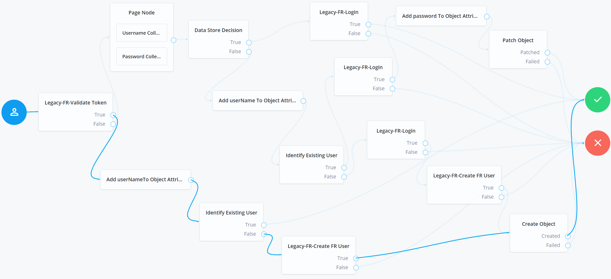
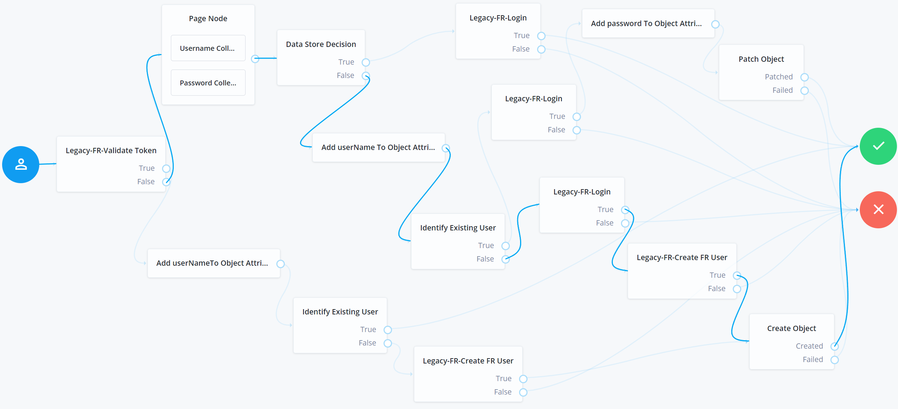
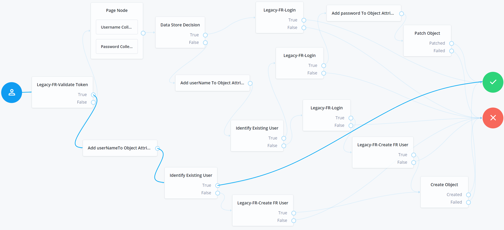

# Disclaimer
The sample code described herein is provided on an "as is" basis, without warranty of any kind, to the fullest extent permitted by law. ForgeRock does not warrant or guarantee the individual success developers may have in implementing the sample code on their development platforms or in production configurations.
<br><br>
ForgeRock does not warrant, guarantee or make any representations regarding the use, results of use, accuracy, timeliness or completeness of any data or information relating to the sample code. ForgeRock disclaims all warranties, expressed or implied, and in particular, disclaims all warranties of merchantability, and warranties related to the code, or any service or software related thereto.
<br><br>
ForgeRock shall not be liable for any direct, indirect or consequential damages or costs of any type arising out of any action taken by you or others related to the sample code.

# Modernize IAM Accelerators - AM Based Bi-Directional SSO and JIT Toolkit
With deployments of tens or hundreds of legacy applications, migration waves may be required to minimize the operational impact on production systems. With this type of use case, coexistence and SSO between legacy IAM and ForgeRock IAM is often needed.
Sometimes putting IG in front of a legacy system is not an option for commercial reasons.

# What's New
Please find below the new features and improvements for the 7.0 Miami Accelerators

### <h2>ForgeRock Modernize IAM Framework Updates</h2>

### <i>Updated - Modernize IAM Accelerators - AM Based Bi-Directional SSO and JIT Toolkit</i>

+ Switched to using the AM 7 identity management nodes
    + Decommissioned Legacy-FR-Set Password node and replaced it with Patch Object node
    + Decommissioned Legacy-FR-Migration Status node and replaced it with Identify Existing User node
	+ Removed the IDM managed user API call from the Legacy-FR-Create FR User node. This node has been updated to fetch the user information and add it to the shared state on the objectAttributes object.
	+ Create Object node is used to create the migrated user.
+ New node: Add Attributes To Object Attributes - this node reads the attributes specified as keys from shared state, and adds them to the fields specified as values on the objectAttributes object of the user that needs to be migrated.
+ New service: LegacyFRService - this service holds all the configurations related to the legacy IAM systems.

## 1. Contents
The toolkit provides a collection of custom nodes and a migration tree that can handle very complex migration scenarios, including bidirectional SSO between legacy IAM and ForgeRock AM.
The framework can be easily extended to support migrations from any legacy IAM platform that is capable of exposing client SDKs/APIs for operations such as:
    - Validating existing legacy IAM tokens
    - Using an authentication API (with a username and password input)

### 1.1. Assets Included
Bidirectional SSO capability between legacy IAM and ForgeRock IAM helps minimize risk and time to market in complex migration projects.
ForgeRock understands customers' needs to speed up migration design decisions and cut implementation time, and is thus delivering the following assets as part of the Migration Accelerators:
- A collection of custom migration authentication nodes (ValidateLegacyToken, GenerateLegacyToken, RetrieveLegacyProfile)
- A prebuilt migration authentication tree with bidirectional SSO support that embeds custom nodes and migration know-how (including handling invalid authentication attempts)
- Password synchronization capabilities inside the authentication tree
- A flex option allowing the extension of the authentication tree and nodes for a specific vendor legacy IAM system

System  | Type                | Name                             | Description
--------| --------------------|----------------------------------|-------------------------------------------------------------------------------------------------------------------------------------------------------
AM      | Node                | Legacy-FR-Validate Token         | Retrieves a token from an existing cookie, validates the token against legacy IAM, and provides as output in the shared state the username and outcome
AM      | Node                | Legacy-FR-Create FR User         | Calls the ForgeRock IDM API to provision the managed user
AM      | Node                | Legacy-FR-Login                  | Based on the username and password from the shared state, executes the legacy IAM login API call
AM      | Node                | Add Attributes To Object Attributes         | Adds the attributes specified as keys from Shared State to the fields specified as values of the user Object that needs to be migrated 
AM      | Tree Hook           | LegacySessionTreeHook            | Manages cookies if a successful login is performed into legacy IAM by the tree
AM      | Service             | LegacyFRService                  | Legacy ForgeRock Service holds all the configurations related to the legacy IAM platform
AM      | Authentication Tree | migrationTree                    | Implements the migration login and bidirectional SSO. Packaged as amster export

## 2. Building The Source Code

+ <b>Important note:</b> The assets presented below are built based on OpenAM version 7.0.

In order to build the project from the command line, follow the steps presented below. Make sure that you have all the prerequisites installed correctly before starting.
<br>
+ <b>Demo video</b> - [downloading and building the source code](https://github.com/ForgeRock/modernize-accelerators/blob/master/forgerock-am-migration-sso-jit/video/Part1-Building_The_Code.mp4) - All the steps below can be followed in this video recording.

### 2.1. Prerequisites - Prepare your Environment

#### 2.1.1. Software and environment

You will need the following software to build the code:

Software               | Required Version
---------------------- | ----------------
Java Development Kit   | 11.0 and above
Maven                  | 3.1.0 and above
Git                    | 1.7.6 and above

The following environment variables should be set:

- `JAVA_HOME` - points to the location of the version of Java that Maven will use.
- `M2_HOME` - points to the location of the Maven installation and settings.
- `MAVEN_OPTS` - sets some options for the JVM when running Maven.

For example, your environment variables should look similar to this:

```
JAVA_HOME=/usr/jdk/jdk-11.0.9
MAVEN_HOME=/opt/apache-maven-3.6.3
MAVEN_OPTS='-Xmx2g -Xms2g -XX:+CMSClassUnloadingEnabled -XX:MaxPermSize=512m'
```

Note: You need access to the ForgeRock private-releases maven repository, and your maven build should point to the settings.xml file downloaded with your backstage account. For more information regarding getting access to the ForgeRock protected repositories, see this [knowledge article](https://backstage.forgerock.com/knowledge/kb/article/a74096897)

#### 2.1.2. Reverse proxy

Usually all components are deployed under the same domain, but if your legacy IAM is under another domain than the ForgeRock applications, you will need a reverse proxy in front of both legacy and ForgeRock. This will ensure all the cookies will be seen between applications from the same domain, otherwise SSO can't be achieved.

### 2.2. Getting the Code

If you want to run the code unmodified, you can simply clone the ForgeRock repository:

```
mkdir demo && cd demo
git clone https://github.com/ForgeRock/modernize-accelerators.git
```


### 2.3. Building the Source Code

The build process and dependencies are managed by Maven. The first time you build the project, Maven will pull 
down all the dependencies and Maven plugins required by the build, which can take a longer time. 
Subsequent builds will be much faster!

```
cd ~/demo/modernize-accelerators/forgerock-am-migration-sso-jit/openam-modernize-auth-nodes
mvn package
```

Maven builds the binary in `openam-modernize-auth-nodes/target/`. The file name format is `openam-modernize-auth-nodes-<current-version>.jar` . 
For example, "openam-modernize-auth-nodes-7.0.1.jar".


### 2.4. Adding the Library to the AM WAR File

+ Download and unzip the AM.war file from ForgeRock BackStage:
[https://backstage.forgerock.com/downloads/browse/am/latest](https://backstage.forgerock.com/downloads/browse/am/featured)

```
cd ~/demo
mkdir openam && cd openam
jar -xf ~/Downloads/AM-7.0.1.war
```

+ Copy the generated JAR file to the /openam/WEB-INF/lib folder:

```
cp ~/demo/modernize-accelerators/forgerock-am-migration-sso-jit/openam-modernize-auth-nodes/openam-modernize-auth-nodes-<current-version>.jar ~/demo/openam/WEB-INF/lib
```

+ Rebuild the WAR file: 

```
cd ~/demo/openam
jar -cf ../openam.war *
```

+ In order for you to see the nodes included in the JAR file you built previously, you must copy and deploy the openam.war file on the container in which AM is deployed.

## 3. Configuration

### 3.1. Configuring Secret Stores

The passwords used in the toolkit authentication tree nodes should be saved in secret stores for security reasons. 
If you need to save any secrets, you can configure secret stores as described in the ForgeRock [documentation](https://backstage.forgerock.com/docs/am/7/security-guide/configure-secret-stores.html#configure-secret-stores).

#### 3.1.1. To Configure a File System Secret Volume Store

+ To configure a global file system secret volume store:
    + Navigate to Configure > Secret Stores.
+ To configure a realm file system secret volume store:
    + Navigate to Realms > Realm Name > Secret Stores.
+ Select the store you want to modify.
+ Enter the directory file name in the Directory field. This directory must be available to all AM instances; for example, by converting it to a shared filesystem, or by creating and maintaining it and its files across instances.
+ (Optional) Enter a suffix to add to the name of each secret in the File suffix field. For example, .txt.
+ Select one of the following from the Value format drop-down list:
    + Plain Text: the secret is provided in UTF-8 encoded text. <b>This type of secret is used in this toolkit example</b>.
    + Base64 encoded: the secret is provided in Base64 encoded binary values.
    + Encrypted text: the plain text secrets are encrypted using AM's encryption key, found at Deployment > Servers > Security > Encryption.
    + Encrypted Base64 encoded: the Base64 encoded binary values are encrypted using AM's encryption key.
    + Encrypted HMAC key: the Base64 encoded binary representation of the HMAC key is encrypted using AM's encryption key.
    + BASE64_HMAC_KEY: the Base64 encoded binary representation of the HMAC key. 
+ Save your changes.
+ On the AM instance's file system, create the directory path configured in the Directory field when the secret store was created.
+ Add all the files containing the secrets into the directory.

### 3.2. Authentication Tree

Please see the ForgeRock [documentation](https://backstage.forgerock.com/docs/am/7/authentication-guide/about-authentication-trees.html#configure-authentication-trees) for information about how to create authentication trees.

To set your custom authentication tree as the default tree inside a realm, navigate to 'Authentication' -> 'Settings' -> 'Core'. Then select your custom authentication tree in the 'Organization Authentication Configuration' field. 


#### 3.2.1. Building the tree

+ <b>Demo video</b> - [building the tree](https://github.com/ForgeRock/modernize-accelerators/blob/master/forgerock-am-migration-sso-jit/video/Part2-Building_The_Tree.mp4) - In this recording you can watch how the tree is built step by step.
<br>


#### 3.2.2. Alternative - Importing the Tree with Amster

The SSO toolkit also comes with a built tree that has been exported with Amster. This tree can be imported to other AM servers. Please refer to the [documentation](https://backstage.forgerock.com/docs/amster/7/user-guide/amster-import-config.html) for information about how to use Amster to import resources.

The tree export and its nodes can be found in the folder: 

```
/modernize-accelerators/forgerock-am-migration-sso-jit/amster-export
```

In our example, the tree was created and exported in the root realm, but as a best practice you should never use the root realm. If you choose to import the migration tree with Amster, make sure to replace the realm property with your own value in the amster-export resources provided.


### 3.3. Tree nodes and services

A node is the core abstraction within an authentication tree. Trees consist of nodes, which can modify the shared state and request input from the user via callbacks.

#### 3.3.1. Legacy-FR-Validate Token
Custom node provided in this SSO toolkit. Detects if an existing legacy token exists in the browser in a specific cookie, and validates this as an active token against the legacy IAM system via an SDK/API call. The default node uses a GET API call with the cookie fetched from the incoming http request. The name of the cookie and the target URL is configurable. The node is vendor-specific and is flexible enough to be tailored for each vendor. The Oracle plugin provides a custom implementation for this node using the OAM11G SDK.

```
Node Class: /src/main/java/org/forgerock/openam/auth/node/LegacyFRValidateToken.java
Configuration File: /src/main/resources/org/forgerock/openam/auth/node/LegacyFRValidateToken.properties
```

<br>

#### 3.3.2. Legacy-FR-Create FR User
Custom node provided in the SSO toolkit. Calls the default ForgeRock IDM managed object API to determine whether the user is already migrated. This node is generic, and does not need to be customized for specific legacy IAM vendor implementations.

```
Node Class: /src/main/java/org/forgerock/openam/auth/node/LegacyFRCreateForgeRockUser.java
Configuration File: /src/main/resources/org/forgerock/openam/auth/node/LegacyfrCreateForgeRockUser.properties
```

| Configuration             | Example              | Description                                                                                                                                      |
| ------------------------- | -------------------- | ------------------------------------------------------------------------------------------------------------------------------------------------ |
| Attribute Names Mapping   | Map<String,String>   | A map which should hold as keys the name of the legacy IAM user attributes, and as values their equivalent name in the ForgeRock IDM database.   |
| Set Password Reset        | true/false - on/off  | Switch used to determine if the node is used in a scenario that cannot migrate the user password. Set to true if the password can't be migrated. |

<br>

#### 3.3.3. Legacy-FR-Login
Custom node provided in the SSO toolkit. Validates credentials (username and password) entered by the user against the legacy IAM system via an SDK/API call. The default node uses a POST API call with the username and password fetched from the shared state. The URL is configurable, the node expects a successful response of 200 OK and a specific cookie to be present in the response. The cookie name is configurable. The node is vendor-specific and is flexible enough to be tailored for each vendor. The Oracle plugin provides a custom implementation for this node using the Oracle Access Client SDK.

```
Node Class: /src/main/java/org/forgerock/openam/auth/node/LegacyFRLogin.java
Configuration File: /src/main/resources/org/forgerock/openam/auth/node/LegacyFRLogin.properties
```
<br>

#### 3.3.4. Add Attributes To Object Attributes
Custom node provided in the SSO toolkit. Takes the attributes given as keys from the Shared state and adds them to the user Object attributes corresponding to the values of the map.

```
Node Class: /src/main/java/org/forgerock/openam/auth/node/AddAttributesToObjectAttributesNode.java
Configuration File: /src/main/resources/org/forgerock/openam/auth/node/AddAttributesToObjectAttributesNode.properties
```
| Configuration             | Example              | Description                                                                                                                                     |
| ------------------------- | -------------------- | ----------------------------------------------------------------------------------------------------------------------------------------------- |
| List of attributes        | Map<String,String>   | A map which should hold as keys the name of the legacy IAM user attributes, and as values their equivalent name in the ForgeRock IDM database.  |             

<br>

#### 3.3.5. Page Node
The default page node in ForgeRock IAM used to capture user credentials. This node is generic, and does not need to be customized for specific legacy IAM vendor implementations.

<br>

#### 3.3.6. Data Store Decision
This is the default node for credential validation in ForgeRock IAM. This node is generic, and does not need to be customized for specific legacy IAM vendor implementations.

<br>

#### 3.3.7. Identify Existing User
This node verifies a user exists based on an identifying attribute, such as an email address, then makes the value of a specified attribute available in a tree's shared state. In this case the node is used to determine if a user is already migrated in IDM. This node requires IDM rsFilter integration to function.

| Configuration             | Example              | Description                                                                                                                                                        |
| ------------------------- | -------------------- | ------------------------------------------------------------------------------------------------------------------------------------------------------------------ |
| Identifier        | userName            | The IDM attribute used to save existing value in sharedState for log in purposes.                                                                                                   |
| Identity Attribute        | userName            | The attribute used to retrieve an existing user.          

<br>

#### 3.3.8. Create Object Node
The Create Object node is used to create a new object in IDM based on information collected during an auth tree flow. Any managed object attributes that are marked as required in IDM will need to be collected during the auth tree flow in order for the new object to be created. This node requires IDM rsFilter integration to function.

| Configuration             | Example              | Description                                                                                                                                                        |
| ------------------------- | -------------------- | ------------------------------------------------------------------------------------------------------------------------------------------------------------------ |
| Identity Resource        | managed/user            | The identity resource in IDM that this node will create. This is used to aid node input requirement declaration. Must match identity resource of the current tree.                                                                                                   |

<br>

#### 3.3.9. Patch Object Node
The Patch Object node is used to update attributes in an existing managed object in IDM. This node requires IDM rsFilter integration to function.

| Configuration             | Example              | Description                                                                                                                                                        |
| ------------------------- | -------------------- | ------------------------------------------------------------------------------------------------------------------------------------------------------------------ |
| Patch as Object           | true/false - on/off  | Whether the patch should be done as object or client. Defaults to false, which represents the oauth client.                                                                                     |
| Ignored Fields        | List<String>            | Fields from sharedState that should be ignored as part of patch. If empty, all fields are attempted as part of the patch.                                                                                                   |
| Identity Resource        | managed/user            | The identity resource in IDM that this node will patch. This is used to aid node input requirement declaration. Must match identity resource of the current tree.                                                                                                   |
| Identity Attribute        | userName            | The attribute used to identify the the object in IDM.      

<br>

#### 3.3.10. Legacy ForgeRock Service
Legacy ForgeRock Service holds all the configurations related to the legacy IAM platform


```
Service Class: /src/main/java/org/forgerock/openam/services/LegacyFRService.java
Configuration File: /src/main/resources/org/forgerock/openam/services/LegacyFRService.properties
```
| Configuration             | Example                                                                                                               | Description                                                             |
| ------------------------- | --------------------------------------------------------------------------------------------------------------------- | ----------------------------------------------------------------------- | 
| Profile details URL       | https://openam.example.com/openam/json/{{realm}}/users/                                                               | URL used for retrieving the profile information from the legacy system. |
| Legacy Login URL          | https://openam.example.com/openam/json/authenticate?realm={{realm}}&authIndexType=service&authIndexValue=authenticate | Endpoint for the authentication service for the legacy system           |
| Legacy cookie name        | iPlanetDirectoryPro                                                                                                   | Name of the SSO token expected by the legacy IAM                        |
| Legacy Token Endpoint     | https://openam.example.com/openam/json/sessions?tokenId=                                                              | Legacy session validation endpoint                                      |


<br>

## 4. Scenarios

+ <b>Demo video</b> - [testing the main tree scenarios](https://github.com/ForgeRock/modernize-accelerators/blob/master/forgerock-am-migration-sso-jit/video/Part3-Testing_The_Tree.mp4) - This video recording demonstrates how the scenarios detailed below are triggered by using the authentication tree.
<br>


### 4.1. Scenario 1 - The user has a valid legacy SSO token in the browser, and accesses the authentication tree
- The user (not previously migrated) authenticates first to the legacy IAM instance.
- The user accesses the authentication tree.
- Upon accessing the tree, the user is automatically logged in because a valid legacy SSO token is present in the browser. As a result, a user profile is created in ForgeRock IDM and AM, with no password set.
<br><br>

<br>

<b>Note:</b> Following this scenario, some users might never get their password migrated before the legacy IAM is decomissioned. To avoid this problem, a [bulk migration toolkit](https://github.com/ForgeRock/modernize-accelerators/tree/master/forgerock-bulk-migration-generic) has been designed.

### 4.2. Scenario 2 - The user accesses the authentication tree, with no legacy SSO token in the browser, after previously accessing Scenario 1 - was created with no password
- The user accesses the authentication tree. The tree is prompting the user for the username and password.
- After providing credentials, the user is successfully authenticated. This happens because the user was successfully logged in to the legacy IAM system. Since the Data Store Decision node returned false but the user was already migrated, and the legacy login was successful, the password is also updated in DS.
<br><br>

<br>

### 4.3. Scenario 3 - The user is not migrated, does not have a valid legacy SSO token, and accesses the authentication tree
- The user accesses the authentication tree. The tree prompts the user for the username and password.
- After providing credentials, the user is successfully authenticated. This happens because the user was successfully logged in to the legacy IAM instance, and the user's profile was successfully provisioned in ForgeRock DS, including the password.
<br><br>

<br>

### 4.4. Scenario 4 - This scenario is triggered when the user has a valid legacy SSO token in the browser and is already migrated
- The user (previously migrated) authenticates first to the legacy IAM.
- The user accesses the authentication tree.
 - The outcome of this scenario is that the user is authenticated automatically to both the legacy IAM, and to ForgeRock AM after execution of the tree has completed.
<br><br>

<br>

### 4.5. Scenario 5 - The user is already migrated, and the Data Store Decision node authenticates the user successfully
- The user accesses the authentication tree. The tree prompts the user for the username and password.
- The outcome of this scenario is that the user is authenticated automatically to both the legacy IAM instance and to ForgeRock AM after execution of the tree has completed.
<br><br>

<br>

## 5. Extending & Customizing
Any changes you need to make to adapt to a specific legacy system can be done in the provided sample nodes. To do so, you first need to import the project you downloaded - /forgerock-am-migration-sso-jit/openam-modernize-auth-nodes from GitHub. The node classes and additional files are described in <b>Chapter 3.3 - Tree nodes and services</b>.
+ <b>Example</b>: To add or remove additional profile attributes, the node <b>CreateUser</b> can be updated. In the method <b>process</b>, you can retrieve additional attributes from the legacy profile details call. You can then map them to the request body in the <b>createProvisioningRequestEntity()</b> method.

## 6. Troubleshooting Common Problems
+ <b>Problem:</b> Changes in configuration don't appear in the AM console after deploying them.<br>
<b>Solution:</b> Make sure to imcrement the plugin version from the method getPluginVersion() associated with the modified node if any changes have been made to the configuration of a node in the Java class or the properties file.
<br><br>
+ <b>Problem:</b> No nodes, not even the out-of-the-box ones, are displayed in the tree creation screen.<br>
<b>Solution:</b> Check the nodes <b>@Attribute(order = number)</b> annotations. This can happen if two or more properties in the same node, have the same <b>order = number</b>.

## 7. Known issues
+ N/A 

## 8. License

This project is licensed under the Apache License, Version 2.0. The following text applies to both this file, and should also be included in all files in the project:

```
/***************************************************************************
 *  Copyright 2021 ForgeRock AS
 *
 * Licensed under the Apache License, Version 2.0 (the "License");
 * you may not use this file except in compliance with the License.
 * You may obtain a copy of the License at
 *
 *    http://www.apache.org/licenses/LICENSE-2.0
 *
 *  Unless required by applicable law or agreed to in writing, software
 *  distributed under the License is distributed on an "AS IS" BASIS,
 *  WITHOUT WARRANTIES OR CONDITIONS OF ANY KIND, either express or implied.
 *  See the License for the specific language governing permissions and
 *  limitations under the License.
 ***************************************************************************/
```
