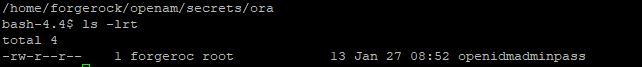
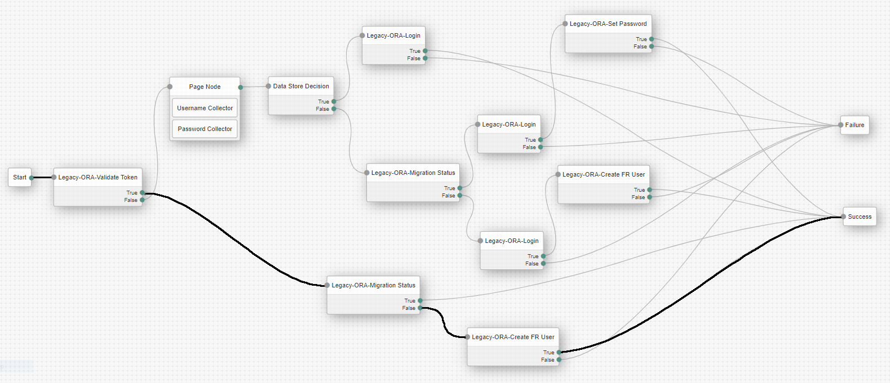
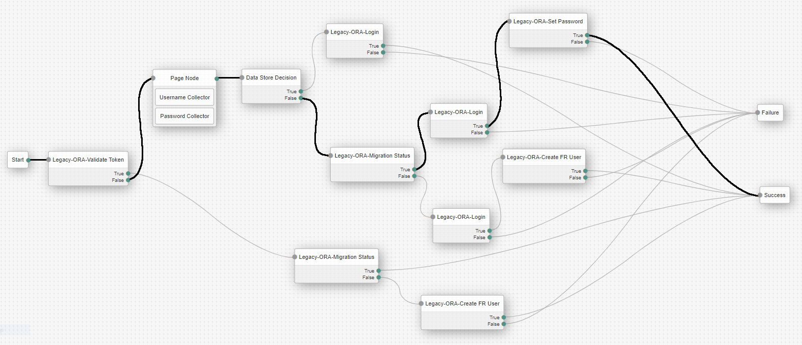
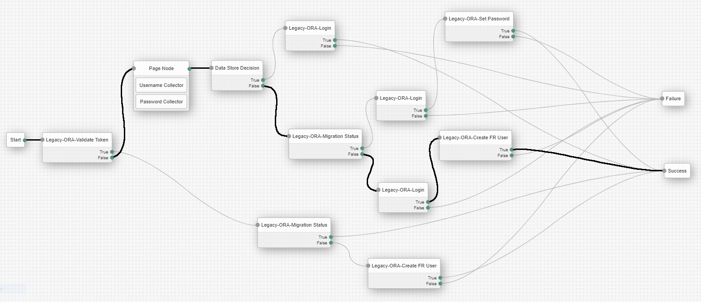
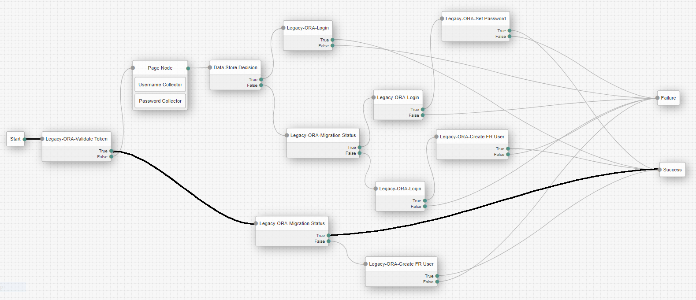
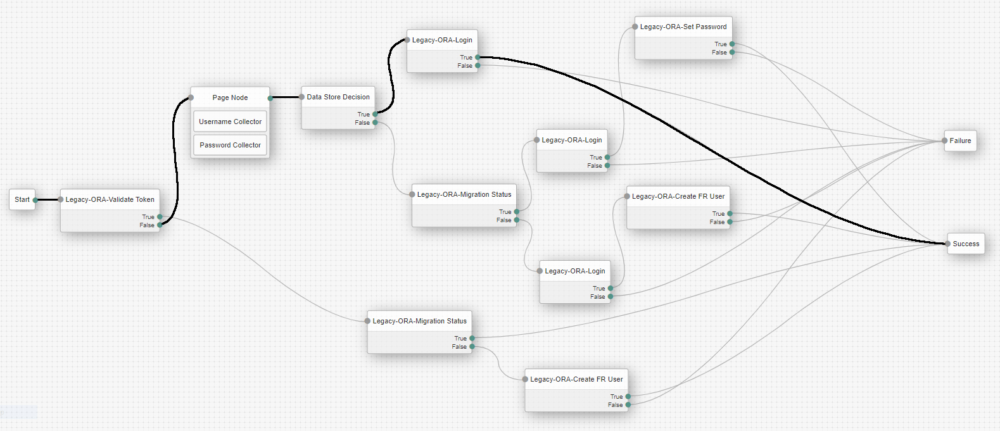

# Disclaimer
The sample code described herein is provided on an "as is" basis, without warranty of any kind, to the fullest extent permitted by law. ForgeRock does not warrant or guarantee the individual success developers may have in implementing the sample code on their development platforms or in production configurations.
<br><br>
ForgeRock does not warrant, guarantee or make any representations regarding the use, results of use, accuracy, timeliness or completeness of any data or information relating to the sample code. ForgeRock disclaims all warranties, expressed or implied, and in particular, disclaims all warranties of merchantability, and warranties related to the code, or any service or software related thereto.
<br><br>
ForgeRock shall not be liable for any direct, indirect or consequential damages or costs of any type arising out of any action taken by you or others related to the sample code.

# Modernize Accelerators - SSO Toolkit (with AM) - Migration from Oracle 11G OAM to ForgerRock
With deployments of tens or hundreds of legacy applications, migration waves may be required to minimize the operational impact on production systems. With this type of use case, coexistence and SSO between legacy IAM and ForgeRock IAM is often needed.
Sometimes putting IG in front of a legacy system is not an option for commercial reasons. 

## 1. Contents
The toolkit provides a collection of custom Nodes and a oracleMigrationSsoTree that can handle very complex migration scenarios, including Bi-Directional SSO between Legacy IAM and Forgerock AM.
The framework can be easily extended to support migrations from any Legacy IAM platform that is capable of exposing client SDKs/APIs for operations such as:
    - Validate existing Legacy IAM tokens
    - Authentication API (with a username and password input)

### 1.1. Assets Included
Bi-Directional SSO capability between Legacy IAM and ForgeRock IAM help minimize risk and time to market in complex migration projects.
ForgeRock understands the customer needs to speed up migration design decisions and cut implementation time, and is thus delivering as part of the Migration Accelerators the following assets:
- Collection of Custom Migration Authentication Nodes (ValidateLegacyToken, GenerateLegacyToken, RetrieveLegacyProfil)
- Pre-built Migration Authentication Tree with Bi-Directional SSO support that embeds the custom nodes and migration know-how (including handle for invalid authentication attempts)
- Password synchronization capabilities inside the Authentication Tree
- Flex option allowing the extension of the Authentication Tree and Nodes for a specific vendor Legacy IAM system

```
System  | Type                | Name                                                | Description
--------| --------------------|-----------------------------------------------------|-----------------------------------------------------------------------------------------------------------------------------------------------------
AM      | Node                | Legacy-ORA-Validate Token                           | Retrieves a token from an existing cookie, validates the token against legacy IAM and provides as output in the shared statethe username and outcome
AM      | Node                | Legacy-ORA-Migration Status                         | Searches in Forgerock IDM the user identity based on the username from the shared state
AM      | Node                | Legacy-ORA-Create FR User                           | Calls the Forgerock IDM API to provision the managed user
AM      | Node                | Legacy-ORA-Login                                    | Based on the username and password from the shared state, executes the Legacy IAM login API call
AM      | Node                | Legacy-ORA-Set Password                             | Updates the Forgerock IDM managed user object with the password captured and stored in the shared state
AM      | Tree Hook           | LegacyORASessionTreeHook                            | Manages cookies if a successfull login is performed into legacy IAM by the tree
AM      | Authentication Tree | oracleMigrationSsoTree                              | Implements the migration login and bi-directional SSO
AM      | Custom Nodes        | openam-modernize-oracle-auth-nodes-1.0-SNAPSHOT.jar | Custom AM nodes that are used in the migration authentication tree
```

## 2. Building The Source Code

+ <b>Important note:</b> The assets presented below are built based on OpenAM version 6.5.2.

In order to build the project from the command line follow the instructions presented below. Make sure that you have all the prerequisites installed correctly before starting.

### 2.1. Prerequisites - Prepare your Environment

You will need the following software to build the code.

```
Software               | Required Version
---------------------- | ----------------
Java Development Kit   | 1.8 and above
Maven                  | 3.1.0 and above
Git                    | 1.7.6 and above
```
The following environment variables should be set:

- `JAVA_HOME` - points to the location of the version of Java that Maven will use.
- `M2_HOME` - points to the location of the Maven installation and settings
- `MAVEN_OPTS` - sets some options for the jvm when running Maven.

For example your environment variables should look similar to this:

```
JAVA_HOME=/usr/jdk/jdk1.8.0_201
MAVEN_HOME=/opt/apache-maven-3.6.3
MAVEN_OPTS='-Xmx2g -Xms2g -XX:+CMSClassUnloadingEnabled -XX:MaxPermSize=512m'
```

+ The source files use some Spring dependencies from the 5.2.1.RELEASE which you need to download. The following jars must be added to WEB-INF/lib
    + [spring-beans-5.2.1.RELEASE](https://mvnrepository.com/artifact/org.springframework/spring-beans)
    + [spring-core-5.2.1.RELEASE](https://mvnrepository.com/artifact/org.springframework/spring-core)
    + [spring-jcl-5.2.1.RELEASE](https://mvnrepository.com/artifact/org.springframework/spring-jcl)
    + [spring-web-5.2.1.RELEASE](https://mvnrepository.com/artifact/org.springframework/spring-web)

+ The source files also use the Oracle Access Manager Access SDK. The following jars must be downloaded from the Oracle downloads page, and added to WEB-INF/lib.
    + identitystore.jar
	+ jps-api.jar
	+ jps-common.jar
	+ jps-internal.jar
	+ jps-unsupported-api.jar
	+ oamasdk-api.jar
	+ oraclepki.jar
	+ osdt_cert.jar
	+ osdt_core.jar
	+ osdt_xmlsec.jar
	
In addition to copying the dependencies inside the AM-x.y.z.war file, you must also add them to your classpath so that your IDE can see all the dependencies correctly. To use the library as a dependency, you can add it to your lib directory for a simple java project, or import it to your maven or gradle project as an artifact.

Example for installing the jar as a maven artifact on a local maven repository:

```
mvn install:install-file \
   -Dfile='/path/to/identitystore.jar' \
   -DgroupId=com.oracle \
   -DartifactId=identitystore \
   -Dversion=1.0.0 \
   -Dpackaging=jar \
   -DgeneratePom=true
```

Example usage of the jar file in the maven's project pom.xml:

```
<dependency>
	<groupId>com.oracle</groupId>
	<artifactId>identitystore</artifactId>
	<version>1.0.0</version>
</dependency>
```

### 2.2. Getting the Code

If you want to run the code unmodified you can simply clone the ForgeRock repository:

```
mkdir demo
git clone https://github.com/ForgeRock/modernize-accelerators.git
```


### 2.3. Building the Code

The build process and dependencies are managed by Maven. The first time you build the project, Maven will pull 
down all the dependencies and Maven plugins required by the build, which can take a longer time. 
Subsequent builds will be much faster!

```
cd modernize-accelerators/forgerock-am-ora-migration-sso-jit/openam-modernize-oracle-auth-nodes
mvn package
```

Maven builds the binary in `openam-modernize-oracle-auth-nodes/target/`. The file name format is `openam-modernize-oracle-auth-nodes-<nextversion>-SNAPSHOT.jar` , 
for example "openam-modernize-oracle-auth-nodes-1.0.0-SNAPSHOT.jar".


### 2.4. Adding the library to OpenAM war

+ Download and unzip your OpenAM.war version from ForgeRock backstage:

```
https://backstage.forgerock.com/downloads/browse/am/latest
mkdir ROOT && cd ROOT
jar -xf ~/Downloads/OpenAM-6.5.2.war
```

+ Copy the newly generated jar file to /ROOT/WEB-INF/lib folder

```
cp ~/openam-modernize-oracle-auth-nodes-<nextversion>-SNAPSHOT.jar WEB-INF/lib
```

+ Rebuild the war file: 

```
jar -cf ../ROOT.war *
```

+ In order for you to see the nodes included in the jar we previously built, on your AM instance, you must copy and deploy the ROOT.war on the container AM is deployed.

## 3. Configuration

### 3.1. Configuring the OAM access client

To generate an access client configuration file, follow the instructions below:

+ Login to OAM console with am administrator user
+ Go to Agents -> Webgates -> Search
+ From the list of available agents, select your SSO Webgate agent
+ From the agent's dedicated page, click the download button. Save the generated <b>OBAccessClient.xml</b> file
+ Create the following folder structure on the ForgeRock AM instance:
```
/path/to/config/oblix/lib
```
+ Copy the previously generated file, <b>OBAccessClient.xml</b>, to the /path/to/config/oblix/lib location.


### 3.2. Configuring Secret Stores

The passwords that are used in the toolkit nodes, must be saved in secret stores for security reasons. Before proceeding with the secret store configuration described below, please also see the ForgeRock [documentation](https://backstage.forgerock.com/docs/am/6.5/maintenance-guide/#configure-secret-stores) regarding secret store.

#### 3.2.1. To Configure a File System Secret Volume Store

+ To configure a global file system secret volume store:
    + Navigate to Configure > Secret Stores.
+ To configure a realm file system secret volume store:
    + Navigate to Realms > Realm Name > Secret Stores.
+ Select the store you want to modify.
+ Enter the directory file name in the Directory field. This directory must be available to all AM instances, for example, by converting it to a shared filesystem, or by creating and maintaining it and its files across instances.
+ (Optional) Enter a suffix to add to the name of each secret in the File suffix field. For example, .txt.
+ From the Value format drop-down list, select one of the following:
    + Plain Text: the secret is provided in UTF-8 encoded text. <b>This type of secret is used in this toolkit example</b>
    + Base64 encoded: the secret is provided in Base64 encoded binary values.
    + Encrypted text: the plain text secrets are encrypted using AM's encryption key, found at Deployment > Servers > Security > Encryption.
    + Encrypted Base64 encoded: the Base64 encoded binary values are encrypted using AM's encryption key.
    + Encrypted HMAC key: the Base64 encoded binary representation of the HMAC key is encrypted using AM's encryption key.
    + BASE64_HMAC_KEY: the Base64 encoded binary representation of the HMAC key. 
+ Save your changes.
+ On the AM instance filesystem, create the directory path configured in the Directory field when the secret store was created.
+ Add all the files containing the secrets into the directory.

+ <b>Example:</b>
    + AM console configuration:
	

    + Filesystem secret id:<br>
	


### 3.3. Authentication Tree

Please see the ForgeRock [documentation](https://backstage.forgerock.com/docs/am/6.5/authentication-guide/index.html#sec-configure-authentication-trees) on how to create authentication trees.

To set your custom authentication tree as the default inside a realm, navigate to 'Authentication' -> 'Settings' and on the 'Core' tab select your custom authentication tree in the field for 'Organization Authentication Configuration'. 


#### 3.3.1. Building the tree


#### 3.3.2. Alternative - Importing the tree with Amster

The SSO toolkit, also comes with built tree exported with Amster, that can be imported on other AM servers. Please refer to the [documentation](https://backstage.forgerock.com/docs/amster/6.5/user-guide/#sec-usage-import) for how to use Amster for importing resources.

The tree export and it's nodes can be found in the folder: 

```
/modernize-accelerators/forgerock-am-ora-migration-sso-jit/amster-export
```

In this example the tree was created and exported in the root realm, but as a best practice you should never use the root realm. If you choose to import the oracleMigrationSsoTree with Amster, please make sure to replace the realm property with your own value in the amster-export resources provided.


### 3.4. Tree Nodes

A node is the core abstraction within an authentication tree. Trees are made up of nodes, which may modify the shared state and/or request input from the user via callbacks.

- <b>Legacy-ORA-Validate Token</b> - Custom node provided in this SSO toolkit. Detects if an existing legacy Token exists in the browser in a specific cookie, and validates this as an active token against the legacy IAM system via an SDK/API call. The default node uses a GET API call with the cookie fetched from the incoming http request. The name of the cookie and the target URL is configurable. The node is vendor-specific and is flexible enough to be tailored for each vendor. The Oracle plugin provides a custom implementation for this Node using the Oracle Access Client SDK.

```
Node Class: /src/main/java/org/forgerock/openam/auth/node/LegacyORAValidateToken.java
Configuration File: /src/main/resources/org/forgerock/openam/auth/node/LegacyORAValidateToken.properties

Configuration                  | Example                                                            | Description
-------------------------------|--------------------------------------------------------------------|-----------------------------------------------------------------------------------------
Legacy cookie name             | iPlanetDirectoryPro                                                | field for the name of the SSO token expected by Oracle OAM
Oracle configuration location  | /path/to/config/oblix/lib/ObAccessClient.xml                       | field for the end point used by the Legacy iAM to verify if an SSO token is valid
Naming attribute               | cn                                                                 | field that holds the attribute name from the OAM user identity, that hold the username value
```

<br>

- <b>Legacy-ORA-Migration Status</b> - Custom node provided in the SSO toolkit. Checks in Forgerock IDM if the user is allready migrated, by calling the default Forgerock IDM managed object API. This node is a generic one and does not need to be customized for specific legacy IAM vendor implementations.

```
Node Class: /src/main/java/org/forgerock/openam/auth/node/LegacyORAMigrationStatus.java
Configuration File: /src/main/resources/org/forgerock/openam/auth/node/LegacyORAMigrationStatus.properties

Configuration          | Example                                                            | Description
---------------------- | -------------------------------------------------------------------|--------------------------------------------------------------------------------
IDM user endpoint      | <<proto>://<<host>>/openidm/managed/user?_queryFilter=userName+eq+ | field for the end point used to verify in ForgeRock IDM if the user is migrated
IDM administrator user | idmAdmin                                                           | field for the IDM admin user used to query the IDM User Endpoint
IDM Password Secret ID | openidmadminpass                                                   | field for the IDM admin password secret id. The secret from the file system with this id. must contain the value of the password for the IDM administrator user
```

<br>

- <b>Page Node</b> - This is the default page node in Forgerock IAM used to capture user credentials. This node is a generic one and does not need to be customized for specific legacy IAM vendor implementations.

<br>

- <b>Legacy-ORA-Create FR User</b> - Custom node provided in the SSO toolkit. Provisions the user in Forgerock IAM by calling the default Forgerock IDM managed object API. This node is a generic one and does not need to be customized for specific legacy IAM vendor implementations. The nodes uses the following shared state attributes: 

```
Node Class: /src/main/java/org/forgerock/openam/auth/node/LegacyORACreateForgeRockUser.java
Configuration File: /src/main/resources/org/forgerock/openam/auth/node/LegacyORACreateForgeRockUser.properties

Configuration          | Example                                                            |Description
---------------------- | -------------------------------------------------------------------|-------------------------------------------------------------------------------------------------------------------------------------------------
Profile details URL    | <<proto>>://<<host>>/oic_rest/rest/userprofile/people/             | field for the end point used to get the profile attributes from the legacy iAM
IDM User Endpoint      | <<proto>>://<<host>>/openidm/managed/user?_action=create           | field for the end point used to create a user in ForgeRock IDM
IDM Admin User         | idmAdmin                                                           | field for the IDM admin user used to query the IDM User Endpoint
IDM Password Secret ID | openidmadminpass                                                   | field for the IDM admin password secret id. The secret from the file system with this id. must contain the value of the password for the IDM administrator user
Set Password Reset     | true/false - on/off                                                | switch used to determine if the node is used on a scenario that cannot migrate the user password. Set to true if the password can't be migrated.
```

<br>

- <b>Data Store Decision</b> - This is the default credentials validation node in Forgerock IAM. This node is a generic one and does not need to be customized for specific legacy IAM vendor implementations.

<br>

- <b>Legacy-ORA-Login</b> - Custom node provided in the SSO toolkit. Validates the credentials (username and password) entered by the user against the legacy IAM system via an SDK/API call. The default node uses a POST API call with the username and password fetched from the shared state. The URL is configurable, the node expects a successfull response of 200 OK and a specific cookie to be present in the response (the cookie name is configurable). The node is vendor-specific and is flexible enough to be tailored for each vendor. The Oracle plugin will provide a custom implementation for this Node using the Oracle Access Client SDK.

```
Node Class: /src/main/java/org/forgerock/openam/auth/node/LegacyORALogin.java
Configuration File: /src/main/resources/org/forgerock/openam/auth/node/LegacyORALogin.properties

Configuration                  | Example                                                            | Description
-------------------------------|--------------------------------------------------------------------|-----------------------------------------------------------------------------------------------
Login endpoint                 | //<<host>>:<<port>>/oam/server/obrareq.cgi                         | the requested, protected HTTP resource for login, in the format required by the Oracle SDK
Login endpoint protocol        | http                                                               | the protocol accepted on the requested resource
Login endpoint method          | GET                                                                | the specific HTTP operation that will be performed against the requested resource
Legacy cookie domain           | .domain.example.com                                                | the domain on which the legacy cookie must be set so it will be visible by OAM SSO
Legacy cookie name             | iPlanetDirectoryPro                                                | field for the name of the SSO token expected by Oracle OAM
Oracle configuration location  | /path/to/config/oblix/lib/ObAccessClient.xml                       | field for the end point used by the Legacy iAM to verify if an SSO token is valid
```

<br>

- <b>Legacy-ORA-Set Password</b> - Custom node provided in the SSO toolkit. Provisions the user password in Forgerock IAM by calling the default Forgerock IDM managed object API. This node is a generic one and does not need to be customized for specific legacy IAM vendor implementations.

```
Node Class: /src/main/java/org/forgerock/openam/auth/node/LegacyORASetPassword.java
Configuration File: /src/main/resources/org/forgerock/openam/auth/node/LegacyORASetPassword.properties

Configuration          | Example                                                                           | Description
---------------------- | ----------------------------------------------------------------------------------|---------------------------------------------------------------------
IDM User Endpoint      | <<proto>>://<<host>>/openidm/managed/user?_action=patch&_queryFilter=userName+eq+ | field for the end point used to create a user in ForgeRock IDM
IDM Admin User         | idmAdmin                                                                          | field for the IDM admin user used to query the IDM User Endpoint
IDM Password Secret ID | openidmadminpass                                                                  | field for the IDM admin password secret id. The secret from the file system with this id. must contain the value of the password for the IDM administrator user
```

## 4. Scenarios

### 4.1. Scenario 1 - The user has a valid legacy SSO token in the browser, and accesses the authentication tree
- The user (not previously migrated) authenticates first in the Legacy iAM.
- The user accesses the authentication tree
- As soon as the user accesses the tree, he is automatically logged in because the Legacy sso token is present in the browser and it's valid. As a result a user profile is created in ForgeRock IDM and AM, with no password set.
<br><br>

<br>

### 4.2. Scenario 2 - The user accesses the authentication tree, with no legacy SSO token in the browser, after previously he accessed Scenario 1 - was created with no password
- The user accesses the authentication tree. The tree is prompting the user for the username and password.
- After the user fills the credentials, he is successfully authenticated. This happens because the user was logged in successfully in the Legacy iAM. Since Data Store Decision has returned false but the user was already migrated, and the legacy login is successful, the password is also updated in DS.
<br><br>

<br>

### 4.3. Scenario 3 - The user is not migrated, does not have a valid legacy SSO token, and accesses the authentication tree
- The user accesses the authentication tree. The tree is prompting the user for the username and password.
- After the user fills the credentials, he is successfully authenticated. This happens because the user was logged in successfully in the Legacy iAM, and his profile was successfully provisioned in ForgeRock DS, including his password.
<br><br>

<br>

### 4.4. Scenario 4 - This scenario is triggered when the user has a valid legacy SSO token in the browser and is already migrated
- The user (previously migrated) authenticates first in the Legacy iAM.
- The user accesses the authentication tree
- The outcome of this scenario is that the user is authenticated automatically with both legacy iAM and ForgeRock token at the end of the tree.

<br>

### 4.5. Scenario 5 - This is the standard scenario triggered when the user is already migrated, and Data Store decision node authenticates the user successfully
- The user accesses the authentication tree. The tree is prompting the user for the username and password.
- The outcome of this scenario is that the user is authenticated automatically with both legacy iAM and ForgeRock token at the end of the tree.

<br>

## 5. Extending & Customizing
Any changes you need to make to adapt to a specific legacy system can be done in the provided sample nodes. To do so you first need to import the project you downloaded - /forgerock-am-ora-migration-sso-jit/openam-modernize-oracle-auth-nodes from GitHub in your preferred IDE. The node classes and additional files are described in <b>Chapter 3.3 - Tree Nodes</b>.
+ <b>Example</b>: To add or remove additional profile attributes, the node <b>Legacy-ORA-Create FR User</b> can be updated. In the method <b>process</b> you can retrieve additional attributes from the legacy profile details call. You can then map them on the request body from the <b>createProvisioningRequestEntity()</b> method.

## 6. Troubleshooting common problems
+ <b>Problem:</b> Changes in configuration don't show up in the OpenAM console after deploy.<br>
<b>Solution:</b> Make sure to imcrement the plugin version from the method getPluginVersion() associated to the modified Node if any changes are made in the Config of a node in the java class or the properties file.
<br><br>
+ <b>Problem:</b> No nodes, not even the out of the box ones, are displayed in the tree creation screen.<br>
<b>Solution:</b> Check the nodes <b>@Attribute(order = number)</b> annotations. This can happen if two or more properties in the same node, have the same <b>order = number</b>.

## 7. Known issues
+ N/A

## 8. License

This project is licensed under the Apache License, Version 2.0. The following text applies to both this file, and should also be included in all files in the project:

```
/***************************************************************************
 *  Copyright 2019 ForgeRock AS
 *
 * Licensed under the Apache License, Version 2.0 (the "License");
 * you may not use this file except in compliance with the License.
 * You may obtain a copy of the License at
 *
 *    http://www.apache.org/licenses/LICENSE-2.0
 *
 *  Unless required by applicable law or agreed to in writing, software
 *  distributed under the License is distributed on an "AS IS" BASIS,
 *  WITHOUT WARRANTIES OR CONDITIONS OF ANY KIND, either express or implied.
 *  See the License for the specific language governing permissions and
 *  limitations under the License.
 ***************************************************************************/
```
