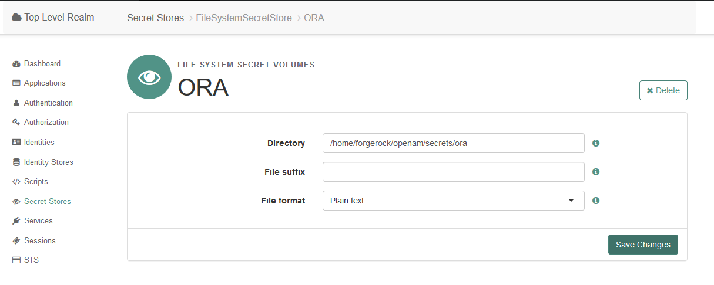
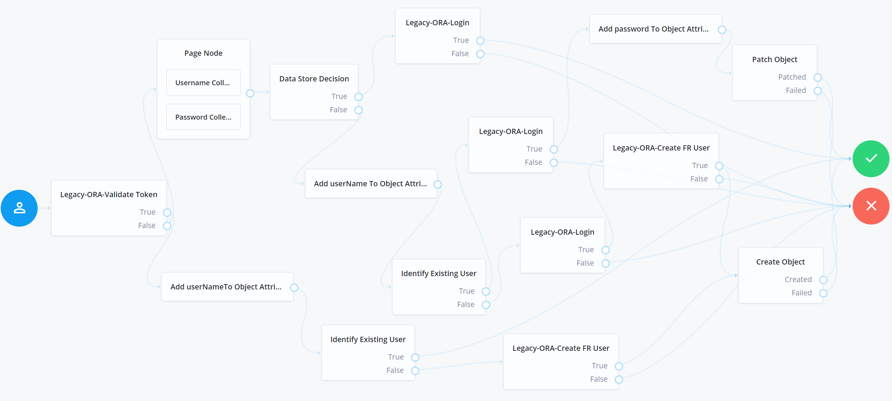
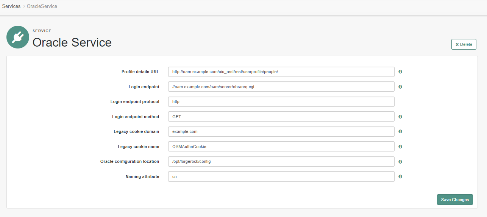
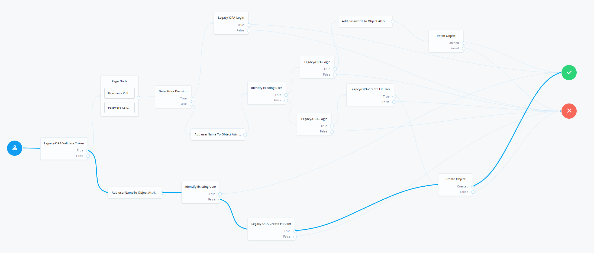
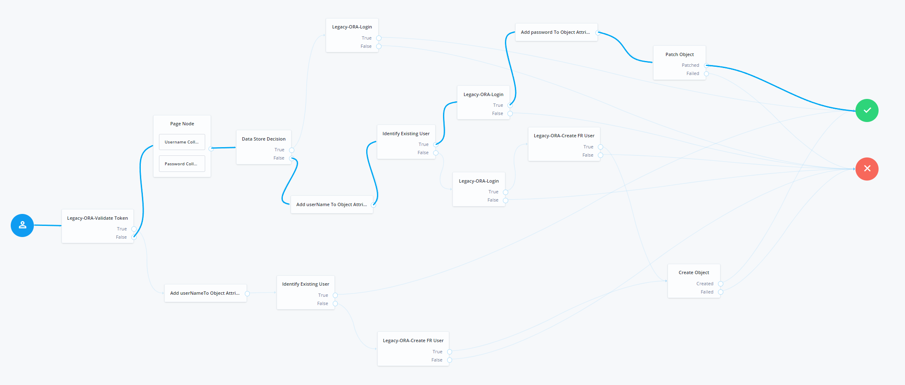
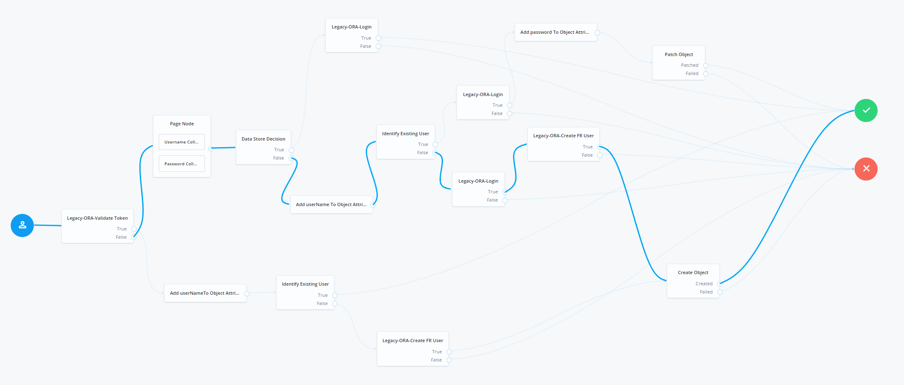
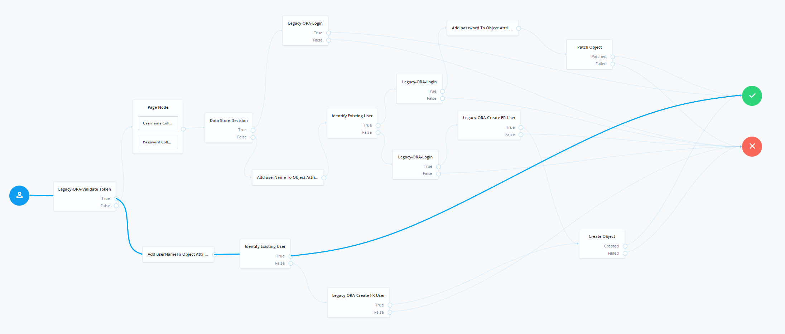
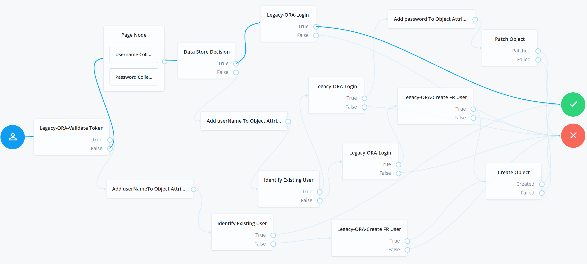

# Disclaimer
The sample code described herein is provided on an "as is" basis, without warranty of any kind, to the fullest extent permitted by law. ForgeRock does not warrant or guarantee the individual success developers may have in implementing the sample code on their development platforms or in production configurations.
<br><br>
ForgeRock does not warrant, guarantee or make any representations regarding the use, results of use, accuracy, timeliness or completeness of any data or information relating to the sample code. ForgeRock disclaims all warranties, expressed or implied, and in particular, disclaims all warranties of merchantability, and warranties related to the code, or any service or software related thereto.
<br><br>
ForgeRock shall not be liable for any direct, indirect or consequential damages or costs of any type arising out of any action taken by you or others related to the sample code.

# Modernize IAM Accelerators - AM Based Bi-Directional SSO and JIT Toolkit - Migration from Oracle 11G OAM to ForgerRock
With deployments of tens or hundreds of legacy applications, migration waves may be required to minimize the operational impact on production systems. With this type of use case, coexistence and SSO between OAM and ForgeRock IAM is often needed.
Sometimes putting IG in front of a legacy system is not an option for commercial reasons. 

# What's New
Please find below the new features and improvements for the 7.0 Miami Accelerators

### <h2>ForgeRock Modernize IAM Accelerators Oracle Plug In Updates</h2>

### <i>Updated - Modernize IAM Accelerators - AM Based Bi-Directional SSO and JIT Toolkit - Migration from Oracle 11G OAM to ForgerRock</i>

+ Switched to using the AM 7 identity management nodes
    + Decommissioned Legacy-ORA-Set Password node and replaced it with Patch Object node
    + Decommissioned Legacy-ORA-Migration Status node and replaced it with Identify Existing User node
	+ Removed the IDM managed user API call from the Legacy-ORA-Create FR User node. This node has been updated to fetch the user information and add it to the shared state on the objectAttributes object.
	+ Create Object node is used to create the migrated user.
+ New node: Add Attributes To Object Attributes - this node reads the attributes specified as keys from shared state, and adds them to the fields specified as values on the objectAttributes object of the user that needs to be migrated.
+ New service: OracleService - this service holds all the configurations related to the OAM legacy systems.
+ Updated code base to support Java 11 dependencies.

## 1. Contents
The toolkit provides a collection of custom Nodes and a oracleMigrationSsoTree that can handle very complex migration scenarios, including Bi-Directional SSO between Legacy OAM11G and Forgerock AM.
The framework can be easily extended to support migrations from any OAM11G platform that is capable of exposing client SDKs/APIs for operations such as:
    - Validate existing Legacy IAM tokens
    - Authentication API (with a username and password input)

### 1.1. Assets Included
Bi-Directional SSO capability between OAM and ForgeRock IAM help minimize risk and time to market in complex migration projects.
ForgeRock understands the customer needs to speed up migration design decisions and cut implementation time, and is thus delivering as part of the Migration Accelerators the following assets:
- Collection of Custom Migration Authentication Nodes (ValidateLegacyToken, GenerateLegacyToken, RetrieveLegacyProfil)
- Pre-built Migration Authentication Tree with Bi-Directional SSO support that embeds the custom nodes and migration know-how (including handle for invalid authentication attempts)
- Password synchronization capabilities inside the Authentication Tree
- Flex option allowing the extension of the Authentication Tree and Nodes for OAM Legacy system

| System  | Type                | Name                                                | Description |
| ------- | ------------------- | --------------------------------------------------- | ------------------------------------------------------------------------------------------------------------------------------------------------- |
| AM      | Node                | Legacy-ORA-Validate Token                           | Retrieves a token from an existing cookie, validates the token against OAM11G and provides as output in the shared state the username and outcome |
| AM      | Node                | Legacy-ORA-Create FR User                           | Executes the OAM11G get user information call and adds the user's details on OBJECT_ATTRIBUTES on shared state and transient state                |
| AM      | Node                | Legacy-ORA-Login                                    | Based on the username and password from the shared state, executes the OAM11G login method call                                                   |
| AM      | Node                | Add Attributes To Object Attributes                 | Adds attributes to OBJECT_ATTRIBUTES on shared state and transient state                                                                          |
| AM      | Tree Hook           | LegacyORASessionTreeHook                            | Manages cookies if a successful login is performed into OAM11G by the tree |
| AM      | Authentication Tree | OAMmigration                              | Implements the migration login and bi-directional SSO |
| AM      | Service             | OracleService                  | Oracle Service holds all the configurations related to the OAM11G legacy platform

## 2. Building The Source Code

+ <b>Important note:</b> The assets presented below are built based on AM version 7.0.

Follow these instructions to build the project from the command line. Make sure that you have all the prerequisites installed correctly before starting.

+ Demo video - [downloading and building the source code](https://github.com/ForgeRock/modernize-accelerators/blob/develop/forgerock-am-ora-migration-sso-jit/video/Oracle-BuildingTheCode.mp4) 

### 2.1. Prerequisites - Prepare Your Environment

#### 2.1.1. Software and Environment

You will need the following software to build the code:

Software               | Required Version
---------------------- | ----------------
Java Development Kit   | 11.0 and above
Maven                  | 3.1.0 and above
Git                    | 1.7.6 and above

Set the following environment variables:

- `JAVA_HOME` - points to the location of the version of Java that Maven will use.
- `M2_HOME` - points to the location of the Maven installation and settings.
- `MAVEN_OPTS` - sets some options for the jvm when running Maven.

For example your environment variables should look like this:

```
JAVA_HOME=/usr/jdk/jdk-11.0.9
MAVEN_HOME=/opt/apache-maven-3.6.3
MAVEN_OPTS='-Xmx2g -Xms2g -XX:+CMSClassUnloadingEnabled -XX:MaxPermSize=512m'
```

Note: You need access to the ForgeRock private-releases maven repository, and your maven build should point to the settings.xml file downloaded with your backstage account. For more information regarding getting access to the ForgeRock protected repositories, see this [knowledge article](https://backstage.forgerock.com/knowledge/kb/article/a74096897)

#### 2.1.2. External libraries

+ The source files also use the Oracle Access Manager Access SDK. Download the SDK from the Oracle [downloads](https://www.oracle.com/middleware/technologies/identity-management/downloads.html) page. Then add the <b>oamasdk-api.jar</b> file to the WEB-INF/lib directory. Other dependencies that are needed as dependencies, and are found in the downloaded SDK, under /opss_standalone/modules/:
    + identitystore.jar
    + jps-api.jar
    + jps-common.jar
    + jps-internal.jar
    + jps-unsupported-api.jar
    + oraclepki.jar
    + osdt_crt.jar
    + osdt_core.jar
    + osdt_xmlsec.jar
	
In addition to copying the external dependencies inside the AM-x.y.z.war file, add them to your classpath, so that your IDE can resolve all the dependencies correctly. To use the library as a dependency, add it to your lib directory for a simple Java project, or import it to your Maven or Gradle project as an artifact.

Example for installing the JAR file as a Maven artifact in a local Maven repository:

```
mvn install:install-file \
   -Dfile='/path/to/oamasdk-api.jar' \
   -DgroupId=oamasdk-api \
   -DartifactId=oamasdk-api \
   -Dversion=1.0.0 \
   -Dpackaging=jar \
   -DgeneratePom=true
```

Example usage of the JAR file in the Maven's project pom.xml file:

```
<dependency>
	<groupId>com.oracle</groupId>
	<artifactId>oamasdk-api</artifactId>
	<version>1.0.0</version>
</dependency>
```

#### 2.1.3. Reverse Proxy

Usually all components are deployed to the same domain, but if your legacy IAM system is in a different domain than the ForgeRock applications, you will need a reverse proxy in front of both the legacy system and ForgeRock. Using a reverse proxy ensures that all the cookies can be accessed by applications in the same domain, enabling SSO. 

### 2.2. Getting the Code

If you want to run the code unmodified, clone the ForgeRock repository:

```
mkdir demo && cd demo
git clone https://github.com/ForgeRock/modernize-accelerators.git
```


### 2.3. Building the Code

The build process and dependencies are managed by Maven. The first time you build the project, Maven pulls 
down all the dependencies and Maven plugins required by the build, which can take a while. Subsequent builds are much faster!

+ Move into the project's root directory and copy the required OAM Access SDK libraries. Once the files are copied, you can package the modernize authentication nodes project.

```
cd ~/demo/modernize-accelerators/forgerock-am-ora-migration-sso-jit/openam-modernize-oracle-auth-nodes
cp ~/Downloads/oam-libs/* ~/demo/modernize-accelerators/forgerock-am-ora-migration-sso-jit/openam-modernize-oracle-auth-nodes/ext-lib/oam-libs/
mvn package
```

Maven builds the binary in the `openam-modernize-oracle-auth-nodes/target/` directory. The file name format is `openam-modernize-oracle-auth-nodes-<current-version>.jar`.
For example, "openam-modernize-oracle-auth-nodes-7.0.1.jar".


### 2.4. Adding the Library to the AM WAR File

+ Download and unzip the AM WAR file from ForgeRock Backstage:
[https://backstage.forgerock.com/downloads/browse/am/latest](https://backstage.forgerock.com/downloads/browse/am/featured)

```
cd ~/demo
mkdir openam && cd openam
jar -xf ~/Downloads/AM-7.0.1.war
```

+ Copy the generated JAR file to the /openam/WEB-INF/lib directory:

```
cp ~/demo/modernize-accelerators/openam-modernize-oracle-auth-nodes-<current-version>.jar ~/demo/openam/WEB-INF/lib
```

+ Copy the required OAM Access SDK libraries to the /openam/WEB-INF/lib directory:

```
cp ~/Downloads/oam-libs/* ~/demo/openam/WEB-INF/lib
```

+ Rebuild the WAR file: 

```
cd ~/demo/openam
jar -cf ../openam.war *
```

+ To see the nodes included in the JAR file, you must copy and deploy the openam.war file in the container in which AM is deployed.

## 3. Configuration

### 3.1. Configuring the OAM Access Client

To generate an access client configuration file, follow the instructions below:

+ Login to the OAM console as the am administrator user.
+ Go to Agents > Webgates > Search.
+ Select your SSO Webgate agent from the list of available agents.
+ From the agent's dedicated page, click the download button. Save the generated <b>OBAccessClient.xml</b> file.
+ Create the following folder structure on the ForgeRock AM file system:
```
/path/to/config/oblix/lib
```
+ Copy the previously generated file, <b>OBAccessClient.xml</b>, to the /path/to/config/oblix/lib location.


### 3.2. Configuring Secret Stores

The passwords used in the toolkit authentication tree nodes should be saved in secret stores for security reasons. 
If you need to save any secrets, you can configure secret stores as described in the ForgeRock [documentation](https://backstage.forgerock.com/docs/am/7/security-guide/configure-secret-stores.html#configure-secret-stores).

#### 3.2.1. To Configure a File System Secret Volume Store

+ To configure a global file system secret volume store:
    + Navigate to Configure > Secret Stores.
+ To configure a realm file system secret volume store:
    + Navigate to Realms > Realm Name > Secret Stores.
+ Select the store you want to modify.
+ Enter the directory file name in the Directory field. This directory must be available to all AM instances; for example, by converting it to a shared filesystem, or by creating and maintaining it and its files across instances.
+ (Optional) Enter a suffix to add to the name of each secret in the File suffix field. For example, .txt.
+ Select one of the following from the Value format drop-down list:
    + Plain Text: the secret is provided in UTF-8 encoded text. <b>This type of secret is used in this toolkit example</b>.
    + Base64 encoded: the secret is provided in Base64 encoded binary values.
    + Encrypted text: the plain text secrets are encrypted using AM's encryption key, found at Deployment > Servers > Security > Encryption.
    + Encrypted Base64 encoded: the Base64 encoded binary values are encrypted using AM's encryption key.
    + Encrypted HMAC key: the Base64 encoded binary representation of the HMAC key is encrypted using AM's encryption key.
    + BASE64_HMAC_KEY: the Base64 encoded binary representation of the HMAC key. 
+ Save your changes.
+ On the AM instance's file system, create the directory path configured in the Directory field when the secret store was created.
+ Add all the files containing the secrets into the directory.

+ <b>Example:</b>
    + AM console configuration:
	

### 3.3. Authentication Tree

For information about how to create authentication trees, refer to the ForgeRock [documentation](https://backstage.forgerock.com/docs/am/7/authentication-guide/about-authentication-trees.html#configure-authentication-trees).

To set your custom authentication tree as the default authentication tree inside a realm, navigate to 'Authentication' > 'Settings'. Then, in the 'Core' tab, select your custom authentication tree in the 'Organization Authentication Configuration' field. 


#### 3.3.1. Building the Tree

+ Demo video - [building the tree](https://github.com/ForgeRock/modernize-accelerators/blob/develop/forgerock-am-ora-migration-sso-jit/video/Oracle-BuildingTheTree.mp4) 



#### 3.3.2. Alternative - Importing the Tree With Amster

The SSO toolkit also comes with a tree in Amster-export format. You can import this tree into other AM servers. For information about how to import Amster resources, refer to the [documentation](https://backstage.forgerock.com/docs/amster/7/user-guide/amster-import-config.html).

The tree export and its nodes can be found in the folder: 

```
/modernize-accelerators/forgerock-am-ora-migration-sso-jit/amster-export
```

In this example the tree was created and exported in the root realm, but as a best practice, you should never use the root realm. If you choose to import the oracleMigrationSsoTree using Amster, please make sure to replace the realm property with your own value in the amster-export resources provided.


### 3.4. Tree Nodes and services

A node is the core abstraction within an authentication tree. Trees are made up of nodes, which can modify the shared state and request input from the user via callbacks.

#### 3.4.1. Legacy-ORA-Validate Token
Custom node provided in the SSO toolkit. Detects if an existing legacy token exists in the browser in a specific cookie, and validates this as an active token against the legacy IAM system via an SDK/API call. The default node uses a GET API call with the cookie fetched from the incoming http request. The name of the cookie and the target URL is configurable. The node is vendor-specific and is flexible enough to be tailored for each vendor. The Oracle plugin provides a custom implementation for this node using the Oracle [Access Client SDK](https://docs.oracle.com/cd/E28280_01/dev.1111/e12491/as_api.htm#CHDBDAGI).

```
Node Class: /src/main/java/org/forgerock/openam/auth/node/LegacyORAValidateToken.java
Configuration File: /src/main/resources/org/forgerock/openam/auth/node/LegacyORAValidateToken.properties
```

<br>

#### 3.4.2. Page Node
Default page node in ForgeRock IAM used to capture user credentials. This node is generic, and does not need to be customized for specific legacy IAM vendor implementations.

<br>

#### 3.4.3. Legacy-ORA-Create FR User
Custom node provided in the SSO toolkit. Provisions the user in ForgeRock IAM by calling the default ForgeRock IDM-managed object API. This node is generic one, and does not need to be customized for specific legacy IAM vendor implementations. The nodes uses the following shared state attributes: 

```
Node Class: /src/main/java/org/forgerock/openam/auth/node/LegacyORACreateForgeRockUser.java
Configuration File: /src/main/resources/org/forgerock/openam/auth/node/LegacyORACreateForgeRockUser.properties
```

| Configuration          | Example                                                            |Description
| ---------------------- | -------------------------------------------------------------------|-------------------------------------------------------------------------------------------------------------------------------------------------
| Attribute Names Mapping   | Map<String,String>   | A map which should hold as keys the name of the legacy IAM user attributes, and as values their equivalent name in the ForgeRock IDM database.   |
| Set Password Reset        | true/false - on/off  | Switch used to determine if the node is used in a scenario that cannot migrate the user password. Set to true if the password can't be migrated. |

<br>

#### 3.4.4. Data Store Decision
Default credentials validation node in ForgeRock IAM. This node is generic, and does not need to be customized for specific legacy IAM vendor implementations.

<br>

#### 3.4.5. Legacy-ORA-Login
Custom node provided in the SSO toolkit. Validates the credentials (username and password) entered by the user against the legacy IAM system via an SDK/API call. The default node uses a POST API call with the username and password fetched from the shared state. The URL is configurable. The node expects a successful response of 200 OK and a specific cookie to be present in the response; the cookie name is configurable. The node is vendor-specific and is flexible enough to be tailored for each vendor. The Oracle plugin will provide a custom implementation for this Node using the Oracle Access Client SDK.

```
Node Class: /src/main/java/org/forgerock/openam/auth/node/LegacyORALogin.java
Configuration File: /src/main/resources/org/forgerock/openam/auth/node/LegacyORALogin.properties
```

<br>

#### 3.4.6. Add Attributes To Object Attributes
Custom node provided in the SSO toolkit. Takes the attributes given as keys from the Shared state and adds them to the user Object attributes corresponding to the values of the map.

```
Node Class: /src/main/java/org/forgerock/openam/auth/node/utils/AddAttributesToObjectAttributesNode.java
Configuration File: /src/main/resources/org/forgerock/openam/auth/node/utils/AddAttributesToObjectAttributesNode.properties
```

| Configuration             | Example              | Description                                                                                                                                                        |
| ------------------------- | -------------------- | ------------------------------------------------------------------------------------------------------------------------------------------------------------------ |
| List of attributes        | Map<String, String>            | A map which should hold as keys the name of the Oracle user attributes, and as values their equivalent name in the ForgeRock IDM database.                                                                                                   |

<br>

#### 3.4.7. Username Collector
Default username collection node in ForgeRock IAM. This node is generic, and does not need to be customized for specific legacy IAM vendor implementations.

<br>

#### 3.4.8. Password Collector
Default password collection node in ForgeRock IAM. This node is generic, and does not need to be customized for specific legacy IAM vendor implementations.

#### 3.4.9. Identify Existing User
Default user identification node in ForgeRock IAM, which checks if a user is present in the IDM database or not.

| Configuration             | Example              | Description                                                                                                                                                        |
| ------------------------- | -------------------- | ------------------------------------------------------------------------------------------------------------------------------------------------------------------ |
| Identifier        | userName            | The IDM attribute used to save existing value in sharedState for log in purposes.                                                                                                   |
| Identity Attribute        | userName            | The attribute used to retrieve an existing user.                                                                                                   |

<br>

#### 3.3.10. Create Object Node
The Create Object node is used to create a new object in IDM based on information collected during an auth tree flow. Any managed object attributes that are marked as required in IDM will need to be collected during the auth tree flow in order for the new object to be created. This node requires IDM rsFilter integration to function.

| Configuration             | Example              | Description                                                                                                                                                        |
| ------------------------- | -------------------- | ------------------------------------------------------------------------------------------------------------------------------------------------------------------ |
| Identity Resource        | managed/user            | The identity resource in IDM that this node will create. This is used to aid node input requirement declaration. Must match identity resource of the current tree.                                                                                                   |

<br>

#### 3.3.11. Patch Object Node
The Patch Object node is used to update attributes in an existing managed object in IDM. This node requires IDM rsFilter integration to function.

| Configuration             | Example              | Description                                                                                                                                                        |
| ------------------------- | -------------------- | ------------------------------------------------------------------------------------------------------------------------------------------------------------------ |
| Patch as Object           | true/false - on/off  | Whether the patch should be done as object or client. Defaults to false, which represents the oauth client.                                                                                     |
| Ignored Fields        | List<String>            | Fields from sharedState that should be ignored as part of patch. If empty, all fields are attempted as part of the patch.                                                                                                   |
| Identity Resource        | managed/user            | The identity resource in IDM that this node will patch. This is used to aid node input requirement declaration. Must match identity resource of the current tree.                                                                                                   |
| Identity Attribute        | userName            | The attribute used to identify the the object in IDM.      

<br>

#### 3.4.12. Oracle Service
Oracle Service holds all the configurations related to the legacy OAM platform



```
Service Class: /src/main/java/org/forgerock/openam/services/OracleService.java
Configuration File: /src/main/resources/org/forgerock/openam/services/OracleService.properties
```
| Configuration                  | Example                                                            | Description
| -------------------------------|--------------------------------------------------------------------|-----------------------------------------------------------------------------------------------
| Profile details URL            | <<proto>>://<<host>>/oic_rest/rest/userprofile/people/             | The endpoint used to get the profile attributes from the legacy IAM
| Login endpoint                 | //<<host>>:<<port>>/oam/server/obrareq.cgi                         | The requested, protected HTTP resource for login, in the format required by the Oracle SDK
| Login endpoint protocol        | http                                                               | The protocol accepted by the requested resource
| Login endpoint method          | GET                                                                | The HTTP operation that will be performed against the requested resource
| Legacy cookie domain           | .domain.example.com                                                | The domain on which the legacy cookie must be set so it will be visible by OAM SSO
| Legacy cookie name             | iPlanetDirectoryPro                                                | The name of the SSO token expected by Oracle OAM
| Oracle configuration location  | /path/to/config/oblix/lib/ObAccessClient.xml                       | The endpoint used by the Legacy IAM to determine whether an SSO token is valid
| Naming attribute               | cn                                                                 | The attribute name from the OAM user identity that contains the username value

<br>

## 4. Scenarios


+ Demo video - [testing the main tree scenarios](https://github.com/ForgeRock/modernize-accelerators/blob/develop/forgerock-am-ora-migration-sso-jit/video/Oracle%20-%20Testing%20The%20Tree.mp4)


### 4.1. Scenario 1 - The user has a valid legacy OAM11G SSO token in the browser, and accesses the authentication tree
- The user (not previously migrated) authenticates first to the legacy OAM11G instance.
- The user accesses the authentication tree.
- Upon accessing the tree, the user is automatically logged in because a valid legacy OAM11G SSO token is present in the browser. As a result, a user profile is created in ForgeRock IDM and AM, with no password set.
<br><br>

<br>

<b>Note:</b> Following this scenario, some users might never get their password migrated before the legacy IAM is decomissioned. To avoid this problem, a [bulk migration toolkit](https://github.com/ForgeRock/modernize-accelerators/tree/master/forgerock-bulk-migration-generic) has been designed.

### 4.2. Scenario 2 - The user accesses the authentication tree, with no legacy OAM11G SSO token in the browser, after previously accessing Scenario 1 - was created with no password
- The user accesses the authentication tree. The tree prompts the user for the username and password.
- After providing credentials, the user is successfully authenticated. This happens because the user was successfully logged in to the legacy OAM11G. Since the Data Store Decision node returned false but the user was already migrated, and the legacy login was successful, the password is also updated in DS.
<br><br>

<br>

### 4.3. Scenario 3 - The user is not migrated, does not have a valid legacy OAM11G SSO token, and accesses the authentication tree
- The user accesses the authentication tree. The tree prompts the user for the username and password.
- After providing credentials, the user is successfully authenticated. This happens because the user was successfully logged in to the legacy OAM11G instance, and the user's profile was successfully provisioned in ForgeRock DS, including the password.
<br><br>

<br>

### 4.4. Scenario 4 - This scenario is triggered when the user has a valid legacy OAM11G SSO token in the browser and is already migrated
- The user (previously migrated) authenticates first to the legacy OAM11G instance.
- The user accesses the authentication tree.
- The outcome of this scenario is that the user is authenticated automatically to both the legacy OAM11G instance and to ForgeRock AM after execution of the tree has completed.

<br>

### 4.5. Scenario 5 - This is the standard scenario triggered when the user is already migrated, and Data Store decision node authenticates the user successfully
- The user accesses the authentication tree. The tree prompts the user for the username and password.
- The outcome of this scenario is that the user is authenticated automatically to both the legacy OAM11G instance and to ForgeRock AM after execution of the tree has completed.

<br>

## 5. Extending and Customizing
Any changes you need to make to adapt to a specific legacy system can be done in the provided sample nodes. To make changes, start by importing the project you downloaded from GitHub (/forgerock-am-ora-migration-sso-jit/openam-modernize-oracle-auth-nodes) in your preferred IDE. The node classes and additional files are described in <b>Chapter 3.4 - Tree Nodes and services</b>.

## 6. Troubleshooting Common Problems
+ <b>Problem:</b> Changes in configuration don't show up in the AM console after deployment.<br>
<b>Solution:</b> Make sure to increment the plugin version from the method getPluginVersion() associated with the modified node if any changes are made in the configuration of a node in the Java class or the properties file.
<br><br>
+ <b>Problem:</b> No nodes, not even the out of the box ones, are displayed in the tree creation screen.<br>
<b>Solution:</b> Check the node's <b>@Attribute(order = number)</b> annotations. This can happen if two or more properties in the same node have the same <b>order = number</b>.

## 7. Known issues
+ N/A

## 8. License

This project is licensed under the Apache License, Version 2.0. The following text applies to both this file, and should also be included in all files in the project:

```
/***************************************************************************
 *  Copyright 2019-2021 ForgeRock AS
 *
 * Licensed under the Apache License, Version 2.0 (the "License");
 * you may not use this file except in compliance with the License.
 * You may obtain a copy of the License at
 *
 *    http://www.apache.org/licenses/LICENSE-2.0
 *
 *  Unless required by applicable law or agreed to in writing, software
 *  distributed under the License is distributed on an "AS IS" BASIS,
 *  WITHOUT WARRANTIES OR CONDITIONS OF ANY KIND, either express or implied.
 *  See the License for the specific language governing permissions and
 *  limitations under the License.
 ***************************************************************************/
```
