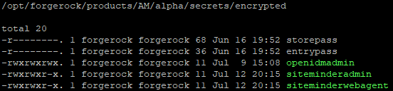
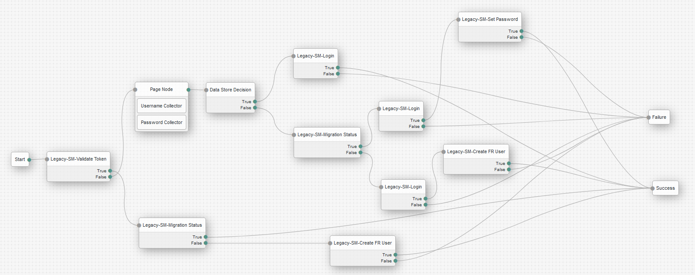
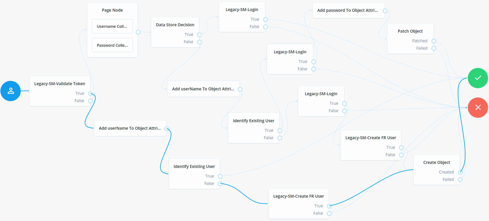
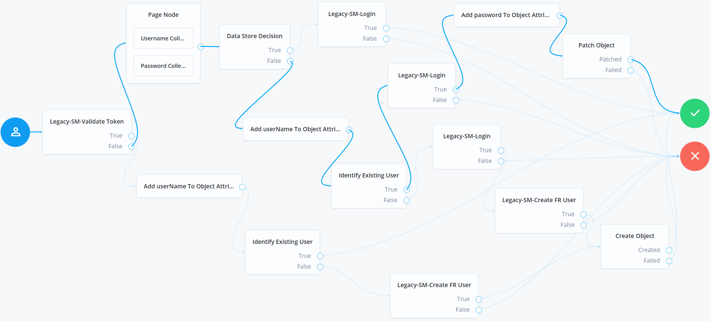
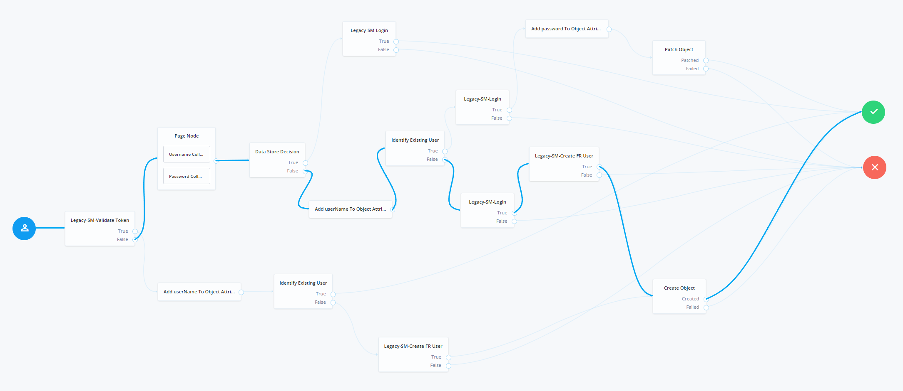
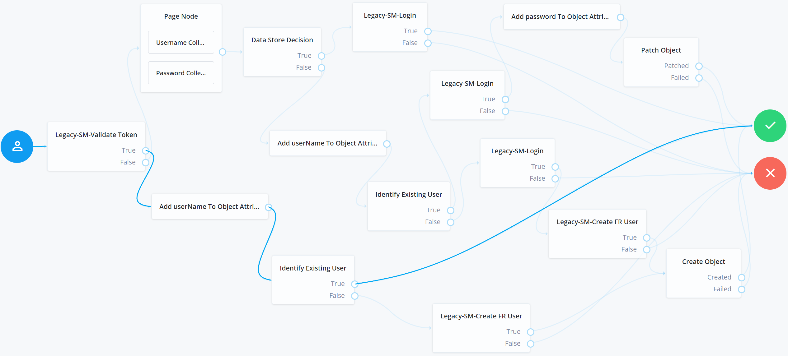
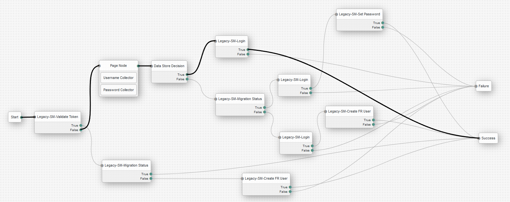

# Disclaimer
The sample code described herein is provided on an "as is" basis, without warranty of any kind, to the fullest extent permitted by law. ForgeRock does not warrant or guarantee the individual success developers may have in implementing the sample code on their development platforms or in production configurations.
<br><br>
ForgeRock does not warrant, guarantee or make any representations regarding the use, results of use, accuracy, timeliness or completeness of any data or information relating to the sample code. ForgeRock disclaims all warranties, expressed or implied, and in particular, disclaims all warranties of merchantability, and warranties related to the code, or any service or software related thereto.
<br><br>
ForgeRock shall not be liable for any direct, indirect or consequential damages or costs of any type arising out of any action taken by you or others related to the sample code.

# Modernize IAM Accelerators - AM Based Bi-Directional SSO and JIT Toolkit - Migration from Siteminder 12.8 to ForgerRock
With deployments of tens or hundreds of legacy applications, migration waves may be required to minimize the operational impact on production systems. With this type of use case, coexistence and SSO between Siteminder and ForgeRock IAM is often needed.
Sometimes putting IG in front of a legacy system is not an option for commercial reasons. 

## 1. Contents
The toolkit provides a collection of custom Nodes and an authentication tree that can handle very complex migration scenarios, including Bi-Directional SSO between Legacy Siteminder 12.8 and Forgerock AM.
The framework can be easily extended to support migrations from any Siteminder platform that is capable of exposing client SDKs/APIs for operations such as:
    - Validate existing Legacy IAM tokens
    - Authentication API (with a username and password input)

### 1.1. Assets Included
Bi-Directional SSO capability between Siteminder and ForgeRock IAM help minimize risk and time to market in complex migration projects.
ForgeRock understands the customer needs to speed up migration design decisions and cut implementation time, and is thus delivering as part of the Migration Accelerators the following assets:
- Collection of Custom Migration Authentication Nodes (ValidateLegacyToken, GenerateLegacyToken, RetrieveLegacyProfile)
- Pre-built Migration Authentication Tree with Bi-Directional SSO support that embeds the custom nodes and migration know-how (including handle for invalid authentication attempts)
- Password synchronization capabilities inside the Authentication Tree
- Flex option allowing the extension of the Authentication Tree and Nodes for Siteminder Legacy system


| System   | Type                 | Name                                                    | Description                                                                                                                                           |
| -------- | -------------------- | ------------------------------------------------------- | ----------------------------------------------------------------------------------------------------------------------------------------------------- |
| AM       | Node                 | Legacy-SM-Validate Token                                | Retrieves a token from an existing cookie, validates the token against Siteminder and provides as output in the shared state the username and outcome |
| AM       | Node                 | Legacy-SM-Migration Status                              | Searches in Forgerock IDM the user identity based on the username from the shared state                                                               |
| AM       | Node                 | Legacy-SM-Create FR User                                | Calls the Forgerock IDM API to provision the managed user                                                                                             |
| AM       | Node                 | Legacy-SM-Login                                         | Based on the username and password from the shared state, executes the Siteminder login method call                                                   |
| AM       | Node                 | Legacy-SM-Set Password                                  | Updates the Forgerock IDM managed user object with the password captured and stored in the shared state                                               |
| AM       | Tree Hook            | LegacySessionTreeHook                                   | Manages cookies if a successful login is performed into Siteminder by the tree                                                                        |
| AM       | Authentication Tree  | siteminderMigrationSsoTree                              | Implements the migration login and bi-directional SSO                                                                                                 |
| AM       | Custom Nodes         | openam-modernize-siteminder-auth-nodes-1.0-SNAPSHOT.jar | Custom AM nodes that are used in the migration authentication tree                                                                                    |


## 2. Building The Source Code

+ <b>Important note:</b> The assets presented below are built based on AM version 6.5.2.3

Follow these instructions to build the project from the command line. Make sure that you have all the prerequisites installed correctly before starting.

+ Demo video - [downloading and building the source code](https://github.com/ForgeRock/modernize-accelerators/blob/develop/forgerock-am-siteminder-migration-sso-jit/video/Oracle%20-%20Building%20The%20Tree.mp4) 

### 2.1. Prerequisites - Prepare Your Environment

#### 2.1.1. Software and Environment

You will need the following software to build the code:


| Software               | Required Version |
| ---------------------- | ---------------- |
| Java Development Kit   | 1.8 and above    |
| Maven                  | 3.1.0 and above  |
| Git                    | 1.7.6 and above  |

Set the following environment variables:

- `JAVA_HOME` - points to the location of the version of Java that Maven will use.
- `M2_HOME` - points to the location of the Maven installation and settings.
- `MAVEN_OPTS` - sets some options for the jvm when running Maven.

For example your environment variables should look like this:

```
JAVA_HOME=/usr/jdk/jdk1.8.0_201
MAVEN_HOME=/opt/apache-maven-3.6.3
MAVEN_OPTS='-Xmx2g -Xms2g -XX:+CMSClassUnloadingEnabled -XX:MaxPermSize=512m'
```

Note: You need access to the ForgeRock private-releases maven repository, and your maven build should point to the settings.xml file downloaded with your backstage account. For more information regarding getting access to the ForgeRock protected repositories, see this [knowledge article](https://backstage.forgerock.com/knowledge/kb/article/a74096897)

#### 2.1.2. External libraries

+ The migration toolkit uses the Siteminder Java AgentAPI and the DMS API. Download the SDK from your Siteminder support page, or get the required .jar files from your existing Siteminder Web Agent installation. The migration toolkit requires the following jar files:
    + smagentapi.jar
    + smjavasdk2.jar
    + smcrypto.jar
    + bc-fips-1.0.1.jar

+ To setup the SDK and the migration toolkit correctly you must:
    + copy the external Siteminder dependencies inside the /WEB-INF/lib of your AM-x.y.z.war file, or directly to you /WEB-INF/lib folder of your ForgeRock AM installation;
	+ add the Siteminder dependencies to your classpath, so that your IDE can resolve all the dependencies correctly. To use the library as a dependency, add it to your lib directory for a simple Java project, or import it to your Maven or Gradle project as an artifact.
	+ Add the Bouncy Castle FIPS .jar to your $JAVA_HOME/jre/lib/ext directory
    + Create a Bouncy Castle FIPS provider entry in the $JAVA_HOME/jre/lib/security/java.security file. Eg: <b>security.provider.N=org.bouncycastle.jcajce.provider.BouncyCastleFipsProvider</b>. Replace N with the order of precedence you would like to give Bouncy Castle in comparison to the other providers in the file.

+ Adding the Siteminder SDK to the classpath.
    + <b>Option 1</b> - copy the jars from the Siteminder web agent installation to the folder /path/to/modernize-accelerators/forgerock-am-siteminder-migration-sso-jit/openam-modernize-siteminder-auth-nodes/ext-lib/siteminder/. This option works with the default pom.xml from this toolkit.
	+ <b>Option 2</b> - install the .jar files to a Maven repository and modify the pom.xml file from the toolkit to point to the repository artifacts.

Example for installing the .jar file as a Maven artifact in a local Maven repository:

```
mvn install:install-file \
   -Dfile='/path/to/smagentapi.jar' \
   -DgroupId=smagentapi \
   -DartifactId=identitystore \
   -Dversion=1.0.0 \
   -Dpackaging=jar \
   -DgeneratePom=true
```

Example usage of the .jar file in the Maven's project pom.xml file:

```
<dependency>
	<groupId>com.siteminder</groupId>
	<artifactId>smagentapi</artifactId>
	<version>1.0.0</version>
</dependency>
```

#### 2.1.3. Reverse Proxy

Usually all components are deployed under the same domain, but if your legacy IAM system is in a different domain than the ForgeRock applications, you will need a reverse proxy in front of both the legacy system and ForgeRock. Using a reverse proxy ensures that all the cookies can be accessed by applications in the same domain, enabling SSO. 

### 2.2. Getting the Code

If you want to run the code unmodified, clone the ForgeRock repository:

```
mkdir demo
git clone https://github.com/ForgeRock/modernize-accelerators.git
```


### 2.3. Building the Code

The build process and dependencies are managed by Maven. The first time you build the project, Maven pulls 
down all the dependencies and Maven plugins required by the build, which can take a while. Subsequent builds are much faster!
									  

```
cd modernize-accelerators/forgerock-am-siteminder-migration-sso-jit/openam-modernize-siteminder-auth-nodes
mvn package
```

Maven builds the binary in the `openam-modernize-siteminder-auth-nodes/target/` directory. The file name format is `openam-modernize-siteminder-auth-nodes-<nextversion>-SNAPSHOT.jar`.
For example, "openam-modernize-siteminder-auth-nodes-1.0.0-SNAPSHOT.jar".


### 2.4. Adding the Library to the AM WAR File

+ Download and unzip the AM WAR file from ForgeRock Backstage:
[https://backstage.forgerock.com/downloads/browse/am/latest](https://backstage.forgerock.com/downloads/browse/am/latest)

```
mkdir ROOT && cd ROOT
jar -xf ~/Downloads/AM-6.5.2.3.war
```

+ Copy the newly generated JAR file to the /ROOT/WEB-INF/lib directory:

```
cp ~/openam-modernize-siteminder-auth-nodes-<nextversion>-SNAPSHOT.jar WEB-INF/lib
```

+ Rebuild the WAR file: 

```
jar -cf ../ROOT.war *
```

+ To see the nodes included in the JAR file, you must copy and deploy the ROOT.war file in the container in which AM is deployed.

## 3. Configuration

### 3.1. Getting ready the Siteminder environment for integration with the SDK

The configurations below must be done on the Siteminder enivornment, to make sure the SDK integration will be successfull:

+ Make sure you have a valid domain configuration. 
+ Create a web agent and configure it on the realm that will be protected. To configure the web agent on the realm, go to Policies > Realms > your realm > Modify > Resource. You can configure the protected resource and the web agent used to authenticate in this section.
+ Go to Agents > Webgates > Search.
+ Allow third party cookies in the agent configuration object (ACO). This ensures that the cookies created by the SDK are accepted by the web agent. To do this, go to: Infrastructure > Agent > Agent Configuration Objects > your agent ACO > AcceptTPCookie > YES

### 3.2. Configuring Secret Stores

The passwords used in the toolkit authentication tree nodes must be saved in secret stores for security reasons. 
The toolkit uses AM secret stores as described in the ForgeRock [documentation](https://backstage.forgerock.com/docs/am/6.5/maintenance-guide/#configure-secret-stores).

#### 3.2.1. To Configure a File System Secret Volume Store

+ To configure a global file system secret volume store:
    + Navigate to Configure > Secret Stores.
+ To configure a realm file system secret volume store:
    + Navigate to Realms > Realm Name > Secret Stores.
+ Select the store you want to modify.
+ Enter the directory file name in the Directory field. This directory must be available to all AM instances; for example, by converting it to a shared filesystem, or by creating and maintaining it and its files across instances.
+ (Optional) Enter a suffix to add to the name of each secret in the File suffix field. For example, .txt.
+ Select one of the following from the Value format drop-down list:
    + Plain Text: the secret is provided in UTF-8 encoded text.
    + Base64 encoded: the secret is provided in Base64 encoded binary values.
    + Encrypted text: the plain text secrets are encrypted using AM's encryption key, found at Deployment > Servers > Security > Encryption.
    + Encrypted Base64 encoded: the Base64 encoded binary values are encrypted using AM's encryption key.
    + Encrypted HMAC key: the Base64 encoded binary representation of the HMAC key is encrypted using AM's encryption key.
    + BASE64_HMAC_KEY: the Base64 encoded binary representation of the HMAC key. 
+ Save your changes.
+ On the AM instance's file system, create the directory path configured in the Directory field when the secret store was created.
+ Add all the files containing the secrets into the directory.

+ <b>Example:</b>
    + AM console configuration:
	

    + Filesystem secret id:<br>
	


### 3.3. Authentication Tree

For information about how to create authentication trees, refer to the ForgeRock [documentation](https://backstage.forgerock.com/docs/am/6.5/authentication-guide/index.html#sec-configure-authentication-trees).

To set your custom authentication tree as the default authentication tree inside a realm, navigate to 'Authentication' > 'Settings'. Then, in the 'Core' tab, select your custom authentication tree in the 'Organization Authentication Configuration' field. 


#### 3.3.1. Building the Tree

+ Demo video - [building the tree](https://github.com/ForgeRock/modernize-accelerators/blob/develop/forgerock-am-siteminder-migration-sso-jit/video/Oracle%20-%20Building%20The%20Tree.mp4) 



#### 3.3.2. Alternative - Importing the Tree With Amster

The SSO toolkit also comes with a tree in Amster-export format. You can import this tree into other AM servers. For information about how to import Amster resources, refer to the [documentation](https://backstage.forgerock.com/docs/amster/6.5/user-guide/#sec-usage-import).

The tree export and its nodes can be found in the folder: 

```
/modernize-accelerators/forgerock-am-siteminder-migration-sso-jit/amster-export
```

In this example the tree was created and exported in the root realm, but as a best practice, you should never use the root realm. If you choose to import the siteminderMigrationSsoTree using Amster, please make sure to replace the realm property with your own value in the amster-export resources provided.


### 3.4. Tree Nodes

A node is the core abstraction within an authentication tree. Trees are made up of nodes, which can modify the shared state and request input from the user via callbacks.

#### 3.4.1. Legacy-SM-Validate Token
Custom node provided in the SSO toolkit. Detects if an existing legacy token exists in the browser in a specific cookie, and validates this as an active token against the legacy IAM system via an SDK/API call. The default node uses a GET API call with the cookie fetched from the incoming http request. The name of the cookie and the target URL is configurable. The node is vendor-specific and is flexible enough to be tailored for each vendor.

```
Node Class: /src/main/java/org/forgerock/openam/auth/node/LegacySMValidateToken.java
Configuration File: /src/main/resources/org/forgerock/openam/auth/node/LegacySMValidateToken.properties
```

| Configuration             | Example              | Description                                                                                                                                                        |
| ------------------------- | -------------------- | ------------------------------------------------------------------------------------------------------------------------------------------------------------------ |
| Legacy cookie name        | SMSESSION            | The name of the SSO token expected by the Siteminder application                                                                                                   |
| Policy server IP          | 96.65.144.165        | The Siteminder Policy server IP address                                                                                                                            |
| Accounting port           | 44441                | Siteminder Accounting server port (0 for none).                                                                                                                    |
| Authentication port       | 44442                | Siteminder Authentication server port (0 for none).                                                                                                                |
| Authorization port        | 44442                | Siteminder Authorization server port (0 for none).                                                                                                                 |
| Minimum connections       | 2                    | Number of initial connections for Siteminder SDK.                                                                                                                  |
| Maximum connections       | 20                   | Maximum number of connections for Siteminder SDK.                                                                                                                  |
| Connection step           | 2                    | Number of connections to allocate when out of connections.                                                                                                         |
| Timeout                   | 60                   | Siteminder SDK Connection timeout in seconds.                                                                                                                      |
| Web agent name            | webagent             | The agent name. This name must match the agent name provided to the Policy Server. The agent name is not case sensitive.                                           |
| Web agent secret id       | secretId             | The secret id of the AM secret that contains the web agent shared secret as defined in the SiteMinder user interface (case sensitive).                             |
| Is 4x Web agent           | true/false - on/off  | True if the "Is 4x Web Agent" check box is active on the Siteminder Web Agent.                                                                                     |
| SM Host File Path         | /path/to/SmHost.conf | Location on the AM instance, where the Siteminder web agent SmHost.conf file is located. Mandatory if "Is 4x Web agent" configuration is set to false (disabled).  |
| Protected resource        | sales                | The name of the resource to check -- for example, /sales.                                                                                                          |
| Protected resource action | GET                  | The action to check for the protected resource -- for example, GET.                                                                                                |
| Debug switch              | true/false - on/off  | Activate for additional debug information.                                                                                                                         |


<br>

#### 3.4.2. Legacy-SM-Migration Status
Custom node provided in the SSO toolkit. Checks ForgeRock IDM to determine whether a user is already migrated by calling the default ForgeRock IDM managed object API. This node is generic, and does not need to be customized for specific legacy IAM vendor implementations.

```
Node Class: /src/main/java/org/forgerock/openam/auth/node/LegacySMMigrationStatus.java
Configuration File: /src/main/resources/org/forgerock/openam/auth/node/LegacySMMigrationStatus.properties
```

| Configuration          | Example              | Description                                                                                                                                      |
| ---------------------- | -------------------- | ------------------------------------------------------------------------------------------------------------------------------------------------ |
| IDM user endpoint      | <<proto>>://<<host>> | Protocol and host for the IDM application. Full URL is built by adding query parameters in the node's backend.                                   |
| IDM administrator user | idmAdmin             | The IDM admin user used to query the IDM user endpoint                                                                                           |
| IDM Password Secret ID | openidmadminpass     | The IDM admin password secret ID. The secret from the file system with this ID must contain the value of the password for the IDM administrator. |


<br>

#### 3.4.3. Page Node
Default page node in ForgeRock IAM used to capture user credentials. This node is generic, and does not need to be customized for specific legacy IAM vendor implementations.

<br>

#### 3.4.4. Legacy-SM-Create FR User
Custom node provided in the SSO toolkit. Provisions the user in ForgeRock IAM by calling the default ForgeRock IDM-managed object API. This node is generic one, and does not need to be customized for specific legacy IAM vendor implementations. The nodes uses the following shared state attributes: 

```
Node Class: /src/main/java/org/forgerock/openam/auth/node/LegacySMCreateForgeRockUser.java
Configuration File: /src/main/resources/org/forgerock/openam/auth/node/LegacySMCreateForgeRockUser.properties
```

| Configuration                         | Example               | Description                                                                                                                                                        |
| ------------------------------------- | ----------------------|------------------------------------------------------------------------------------------------------------------------------------------------------------------- |
| IDM User Endpoint                     | <<proto>>://<<host>>  | Protocol and host for the IDM application. Full URL is built by adding query parameters in the node's backend.                                                     |
| IDM Admin User                        | idmAdmin              | The IDM admin user used to query the IDM user endpoint                                                                                                             |
| IDM Password Secret ID                | openidmadminpass      | The IDM admin password secret ID. The secret from the file system with this ID must contain the value of the password for the IDM administrator user               |
| Set Password Reset                    | true/false - on/off   | Switch used to determine if the node is used in a scenario that cannot migrate the user password. Set to true if the password can't be migrated.                   |
| Policy server IP                      | 96.65.144.165         | The Siteminder Policy server IP address                                                                                                                            |
| Accounting port                       | 44441                 | Siteminder Accounting server port (0 for none).                                                                                                                    |
| Authentication port                   | 44442                 | Siteminder Authentication server port (0 for none).                                                                                                                |
| Authorization port                    | 44442                 | Siteminder Authorization server port (0 for none).                                                                                                                 |
| Minimum connections                   | 2                     | Number of initial connections for Siteminder SDK.                                                                                                                  |
| Maximum connections                   | 20                    | Maximum number of connections for Siteminder SDK.                                                                                                                  |
| Connection step                       | 2                     | Number of connections to allocate when out of connections.                                                                                                         |
| Timeout                               | 60                    | Siteminder SDK Connection timeout in seconds.                                                                                                                      |
| Web agent name                        | webagent              | The agent name. This name must match the agent name provided to the Policy Server. The agent name is not case sensitive.                                           |
| Web agent secret id                   | secretId              | The secret id of the AM secret that contains the web agent shared secret as defined in the SiteMinder user interface (case sensitive).                             |
| Is 4x Web agent                       | true/false - on/off   | True if the "Is 4x Web Agent" check box is active on the Siteminder Web Agent.                                                                                     |
| SM Host File Path                     | /path/to/SmHost.conf  | Location on the AM instance, where the Siteminder web agent SmHost.conf file is located. Mandatory if "Is 4x Web agent" configuration is set to false (disabled).  |
| Protected resource                    | sales                 | The name of the resource to check -- for example, /sales.                                                                                                          |
| Protected resource action             | GET                   | The action to check for the protected resource -- for example, GET.                                                                                                |
| Debug switch                          | true/false - on/off   | Activate for additional debug information.                                                                                                                         |
| Migration attributes mapping          | Map<String,String>    | A map which should hold as keys the name of the SiteMinder user attributes, and as values their equivalent name in the ForgeRock IDM database.                     |
| SiteMinder DMS administrator          | smadmin               | Distinguished name of the administrator which has rights to read the directory which holds the user entries.                                                       |
| SiteMinder DMS administrator password | adminSecretId         | Secret id for the password of the DMS administrator logging in to retrieve user attributes from the user directory.                                                |
| SM User directory                     | userdirectory         | Name of the Siteminder user directory                                                                                                                              |
| SM user directory root                | dc=mycompany,dc=com   | The user directory root search base                                                                                                                                |
| SM username attribute                 | samaccountname        | The username attribute used to search for a user, given it's username.                                                                                             |
| SM user object class                  | user                  | The object class used to define the users                                                                                                                          |


<br>

#### 3.4.5. Data Store Decision
Default credentials validation node in ForgeRock IAM. This node is generic, and does not need to be customized for specific legacy IAM vendor implementations.

<br>

#### 3.4.6. Legacy-SM-Login
Custom node provided in the SSO toolkit. Validates the credentials (username and password) entered by the user against the legacy IAM system via an SDK/API call. The default node uses a POST API call with the username and password fetched from the shared state. The URL is configurable. The node expects a successful response of 200 OK and a specific cookie to be present in the response; the cookie name is configurable. The node is vendor-specific and is flexible enough to be tailored for each vendor.

```
Node Class: /src/main/java/org/forgerock/openam/auth/node/LegacySMLogin.java
Configuration File: /src/main/resources/org/forgerock/openam/auth/node/LegacySMLogin.properties
```

| Configuration             | Example              | Description                                                                                                                                                        |
| ------------------------- | -------------------- | ------------------------------------------------------------------------------------------------------------------------------------------------------------------ |
| Legacy cookie name        | SMSESSION            | The name of the SSO token expected by the Siteminder application                                                                                                   |
| Policy server IP          | 96.65.144.165        | The Siteminder Policy server IP address                                                                                                                            |
| Accounting port           | 44441                | Siteminder Accounting server port (0 for none).                                                                                                                    |
| Authentication port       | 44442                | Siteminder Authentication server port (0 for none).                                                                                                                |
| Authorization port        | 44442                | Siteminder Authorization server port (0 for none).                                                                                                                 |
| Minimum connections       | 2                    | Number of initial connections for Siteminder SDK.                                                                                                                  |
| Maximum connections       | 20                   | Maximum number of connections for Siteminder SDK.                                                                                                                  |
| Connection step           | 2                    | Number of connections to allocate when out of connections.                                                                                                         |
| Timeout                   | 60                   | Siteminder SDK Connection timeout in seconds.                                                                                                                      |
| Web agent name            | webagent             | The agent name. This name must match the agent name provided to the Policy Server. The agent name is not case sensitive.                                           |
| Web agent secret id       | secretId             | The secret id of the AM secret that contains the web agent shared secret as defined in the SiteMinder user interface (case sensitive).                             |
| Is 4x Web agent           | true/false - on/off  | True if the "Is 4x Web Agent" check box is active on the Siteminder Web Agent.                                                                                     |
| SM Host File Path         | /path/to/SmHost.conf | Location on the AM instance, where the Siteminder web agent SmHost.conf file is located. Mandatory if "Is 4x Web agent" configuration is set to false (disabled).  |
| Protected resource        | sales                | The name of the resource to check -- for example, /sales.                                                                                                          |
| Protected resource action | GET                  | The action to check for the protected resource -- for example, GET.                                                                                                |
| Debug switch              | true/false - on/off  | Activate for additional debug information.                                                                                                                         |
| Legacy cookie domain      | .domain.example.com  | The domain on which the legacy cookie must be set so it will be visible by Siteminder SSO                                                                          |


<br>

#### 3.4.7. Legacy-SM-Set Password
Custom node provided in the SSO toolkit. Provisions the user password in ForgeRock IAM by calling the default ForgeRock IDM managed object API. This node is generic, and does not need to be customized for specific legacy IAM vendor implementations.

```
Node Class: /src/main/java/org/forgerock/openam/auth/node/LegacySMSetPassword.java
Configuration File: /src/main/resources/org/forgerock/openam/auth/node/LegacySMSetPassword.properties
```

| Configuration          | Example              | Description                                                                                                                                           |
| ---------------------- | -------------------- | ----------------------------------------------------------------------------------------------------------------------------------------------------- |
| IDM User Endpoint      | <<proto>>://<<host>> | Protocol and host for the IDM application. Full URL is built by adding query parameters in the node's backend.                                        |
| IDM Admin User         | idmAdmin             | The IDM admin user used to query the IDM user endpoint                                                                                                |
| IDM Password Secret ID | openidmadminpass     | The IDM admin password secret ID. The secret from the file system with this ID must contain the value of the password for the IDM administrator user. |


## 4. Scenarios


+ Demo video - [testing the main tree scenarios](https://github.com/ForgeRock/modernize-accelerators/blob/develop/forgerock-am-siteminder-migration-sso-jit/video/Oracle%20-%20Testing%20The%20Tree.mp4)


### 4.1. Scenario 1 - The user has a valid legacy Siteminder SSO token in the browser, and accesses the authentication tree
- The user (not previously migrated) authenticates first to the legacy Siteminder protected resource.
- The user accesses the authentication tree.
- Upon accessing the tree, the user is automatically logged in because a valid legacy Siteminder SSO token is present in the browser. As a result, a user profile is created in ForgeRock IDM and AM, with no password set.
<br><br>

<br>

<b>Note:</b> Following this scenario, some users might never get their password migrated before the legacy IAM is decomissioned. To avoid this problem, a [bulk migration toolkit](https://github.com/ForgeRock/modernize-accelerators/tree/master/forgerock-bulk-migration-generic) has been designed.

### 4.2. Scenario 2 - The user accesses the authentication tree, with no legacy Siteminder SSO token in the browser, after previously accessing Scenario 1 - was created with no password
- The user accesses the authentication tree. The tree prompts the user for the username and password.
- After providing credentials, the user is successfully authenticated. This happens because the user was successfully logged in to the legacy Siteminder environment. Since the Data Store Decision node returned false but the user was already migrated, and the legacy login was successful, the password is also updated in DS.
<br><br>

<br>

### 4.3. Scenario 3 - The user is not migrated, does not have a valid legacy Siteminder SSO token, and accesses the authentication tree
- The user accesses the authentication tree. The tree prompts the user for the username and password.
- After providing credentials, the user is successfully authenticated. This happens because the user was successfully logged in to the legacy Siteminder instance, and the user's profile was successfully provisioned in ForgeRock DS, including the password.
<br><br>

<br>

### 4.4. Scenario 4 - This scenario is triggered when the user has a valid legacy Siteminder SSO token in the browser and is already migrated
- The user (previously migrated) authenticates first to the legacy Siteminder instance.
- The user accesses the authentication tree.
- The outcome of this scenario is that the user is authenticated automatically to both the legacy Siteminder instance and to ForgeRock AM after execution of the tree has completed.

<br>

### 4.5. Scenario 5 - This is the standard scenario triggered when the user is already migrated, and Data Store decision node authenticates the user successfully
- The user accesses the authentication tree. The tree prompts the user for the username and password.
- The outcome of this scenario is that the user is authenticated automatically to both the legacy Siteminder instance and to ForgeRock AM after execution of the tree has completed.

<br>

## 5. Extending and Customizing
Any changes you need to make to adapt to a specific legacy system can be done in the provided sample nodes. To make changes, start by importing the project you downloaded from GitHub (/forgerock-am-siteminder-migration-sso-jit/openam-modernize-siteminder-auth-nodes) in your preferred IDE. The node classes and additional files are described in <b>Chapter 3.3 - Tree Nodes</b>.

## 6. Troubleshooting Common Problems
+ <b>Problem:</b> Changes in configuration don't show up in the AM console after deployment.<br>
<b>Solution:</b> Make sure to increment the plugin version from the method getPluginVersion() associated with the modified node if any changes are made in the configuration of a node in the Java class or the properties file.<br>
+ <b>Problem:</b> No nodes, not even the out of the box ones, are displayed in the tree creation screen.<br>
<b>Solution:</b> Check the node's <b>@Attribute(order = number)</b> annotations. This can happen if two or more properties in the same node have the same <b>order = number</b>.
+ <b>Problem:</b> The SMSESSION cookie created by ForgeRock is not recognized and this error message can be seen in the Siteminder agent logs: "Unable to process SMSESSION cookie"<br>
<b>Solution:</b> Third party cookies are disabled in the Siteminder ACO. To fix this, go to: Infrastructure > Agent > Agent Configuration Objects > your agent ACO > AcceptTPCookie > YES
+ <b>Problem:</b> The SMSESSION cookie created by ForgeRock, with the SDK, is showing as LOGGEDOFF when accessing the Siteminder application, even if it was created recently.<br>
<b>Solution:</b> Make sure that your Siteminder server and the ForgeRock AM server have the date and time synchronized correctly with each other.

## 7. Known issues
+ N/A

## 8. License

This project is licensed under the Apache License, Version 2.0. The following text applies to both this file, and should also be included in all files in the project:

```
/***************************************************************************
 *  Copyright 2020 ForgeRock AS
 *
 * Licensed under the Apache License, Version 2.0 (the "License");
 * you may not use this file except in compliance with the License.
 * You may obtain a copy of the License at
 *
 *    http://www.apache.org/licenses/LICENSE-2.0
 *
 *  Unless required by applicable law or agreed to in writing, software
 *  distributed under the License is distributed on an "AS IS" BASIS,
 *  WITHOUT WARRANTIES OR CONDITIONS OF ANY KIND, either express or implied.
 *  See the License for the specific language governing permissions and
 *  limitations under the License.
 ***************************************************************************/
```
