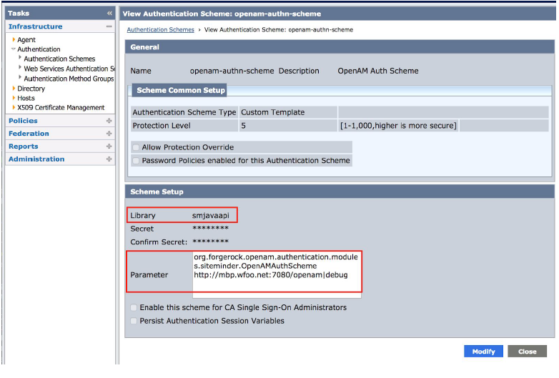
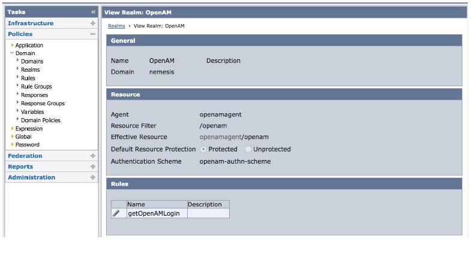
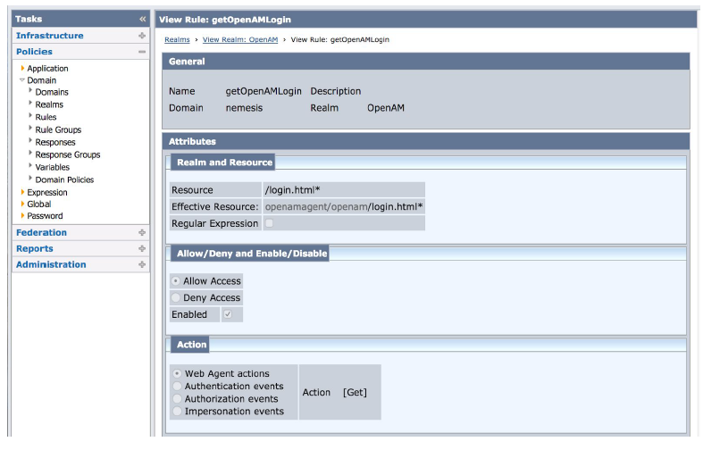
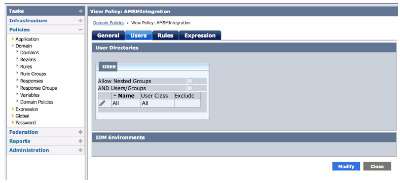

# Disclaimer
The sample code described herein is provided on an "as is" basis, without warranty of any kind, to the fullest extent permitted by law. ForgeRock does not warrant or guarantee the individual success developers may have in implementing the sample code on their development platforms or in production configurations.
<br><br>
ForgeRock does not warrant, guarantee or make any representations regarding the use, results of use, accuracy, timeliness or completeness of any data or information relating to the sample code. ForgeRock disclaims all warranties, expressed or implied, and in particular, disclaims all warranties of merchantability, and warranties related to the code, or any service or software related thereto.
<br><br>
ForgeRock shall not be liable for any direct, indirect or consequential damages or costs of any type arising out of any action taken by you or others related to the sample code.

# Modernize IAM Accelerators - Siteminder Authentication Scheme
With deployments of tens or hundreds of legacy applications, migration waves may be required to minimize the operational impact on production systems. With this type of use case, coexistence and SSO between Siteminder and ForgeRock IAM is often needed.
Sometimes putting IG in front of a legacy system is not an option for commercial reasons.

## 1. Contents
This toolkit contains an authentication scheme that enables Siteminder to recognize ForgeRock AM session cookies.

### 1.1. Assets Included
This package contains the Siteminder authentication scheme org.forgerock.openam.authentication.modules.siteminder.OpenAMAuthScheme. This authentication scheme must be deployed on the Siteminder platform.

## 2. Building The Source Code

+ <b>Important notes:</b> 
    + The assets presented in this package are built based on AM version 6.5.

Make sure that you have all the prerequisites installed correctly before starting.

### 2.1. Prerequisites - Prepare Your Environment

#### 2.1.1. Software and Environment

You will need the following software to build the code:

| Software               | Required Version |
| ---------------------- | ---------------- |
| Java Development Kit   | 1.8              |
| Maven                  | 3.1.0 and above  |
| Git                    | 1.7.6 and above  |

Set the following environment variables:

- `JAVA_HOME` - points to the location of the version of Java that Maven will use.
- `MAVEN_HOME` - points to the location of the Maven installation and settings.
- `MAVEN_OPTS` - sets some options for the jvm when running Maven.

For example your environment variables should look like this:

```
JAVA_HOME=/usr/jdk/jdk1.8.0_131
MAVEN_HOME=/opt/apache-maven-3.6.3
MAVEN_OPTS='-Xmx2g -Xms2g -XX:+CMSClassUnloadingEnabled -XX:MaxPermSize=512m'
```

Note: You need access to the ForgeRock private-releases maven repository, and your maven build should point to the settings.xml file downloaded with your backstage account. For more information regarding getting access to the ForgeRock protected repositories, see this [knowledge article](https://backstage.forgerock.com/knowledge/kb/article/a74096897)

#### 2.1.2. External libraries

+ The migration toolkit uses the Siteminder Java AgentAPI. Download the SDK from your Siteminder support page, or get the required .jar files from your existing Siteminder Web Agent installation. The migration toolkit requires the following jar files:
    + smjavaagentapi.jar
    + SmJavaApi.jar
	
+ Copy the SDK jars inside the project directory /libSM

### 2.2. Getting the Code

If you want to run the code unmodified, clone the ForgeRock repository:

```
mkdir demo
cd demo
git clone https://github.com/ForgeRock/modernize-accelerators.git
```

### 2.3. Building the Code

The build process and dependencies are managed by Maven. The first time you build the project, Maven pulls 
down all the dependencies and Maven plugins required by the build, which can take a while. Subsequent builds are much faster!


```
cd modernize-accelerators/forgerock-siteminder-authentication-scheme
mvn package
```

## 3. Installing the authentication scheme on the Siteminder policy server

### 3.1. Log into the CA Policy Server Admin UI and perform the following tasks:
+ Create a custom authentication scheme as shown on the next picture. Note the “debug” parameter should be removed in production.
	

### 3.2. Create a new realm and assign this authentication scheme to it
+ The realm can be created in an existing Domain or added to a new Domain. In this new realm create a new rule as shown. Note it is recommended that you use a dedicated webserver instance and agent for this integration. However you can use an existing one also keeping in mind that the protected resource (path) is created in either case as illustrated in step 3.5.
	

### 3.3. Add a new Rule


### 3.4. Create a Domain Policy
+ Make sure you configure the same user repository as the one OpenAM is pointing to or that the two disparate repositories are synchronized.
	

### 3.5. Create <apache-docroot>/openam/login.html

### 3.6. Add the openam-auth-siteminder-x.x.x.jar file and json-xxxxxxxx.jar (from json.org) to the policy server's “java.class.path” in config/JVMOptions.txt:
+ -Djava.class.path=/zroot/ca/siteminder/resources:/zroot/ca/siteminder/config/properties:/zroot/ca/siteminder/bin/jars/smbootstrap.jar:/zroot/ca/siteminder/bin/jars/openam-auth-siteminder-1.0.0-SNAPSHOT.jar:/zrot/ca/siteminder/bin/jars/json-20160810.jar

## 4. Troubleshooting

+ <b>Problem</b>: Smps log - [SmJavaAPI.cpp:639][ERROR][sm-JavaApi-00670]SmJavaAPI: Unable to get a JVM environment
<br><b>Solution</b>: There are a few reasons for this error but in this particular case it was due to incorrect JDK path setting to just “/usr”. Hence smjavaapi was not able to find the appropriate libjvm.so. Ensure that in ca_ps_env.ksh proper path is defined. For example NETE_JDK_ROOT="/zroot/orcl/jdk1.8.0_131" NETE_JRE_ROOT="/zroot/orcl/jdk1.8.0_131/jre"

+ <b>Problem</b>: Smps log - [SmAuthServer.cpp:339][ERROR][sm-Server-02940] Failed to query authentication scheme 'openam-authn-scheme'
<br><b>Solution</b>: If your authentication scheme is defined in the wrong domain or is not associated with the correct realm, you will see this error.

+ <b>Problem</b>: Agent log - [sm-AgentFramework-00520] LLA: SiteMinder Agent Api function failed - 'Sm_AgentApi_IsProtectedEx' returned '-1'.
<br><b>Solution</b>: If this is the last line that you see in the smps.log when the custom auth scheme debugging is enabled, it means that the openam client sdk is missing libraries from the classpath in JVMOptions.txt.

+ <b>Problem</b>: SiteMinder debug log file of openam - TransactionId[e94de590-c5ca-4d10-9cc6-54dc379da7b0-75095]ERROR: SMSessionUtils.createSmSession()Siteminder authentication unsuccesful,user=wahmed, response=404
<br><b>Solution</b>: Ensure that you have the login.html file in the web server’s docroot/openam/login.html directory or any other path of your choice to which the SiteMinder Policy Realm is pointing to.

+ <b>Problem</b>: CoreSystem debug log file of openam - Caused by: java.lang.NoClassDefFoundError: Could not initialize class com.ca.siteminder.sdk.agentapi.connection.SmAgentApiConnection
<br><b>Solution</b>: https://docops.ca.com/ca-single-sign-on/12-52-sp1/en/programming/programming-in-java/agent-api-guidance-for-java#AgentAPIGuidanceforJava-ImplementthePureJavaAgentAPI
